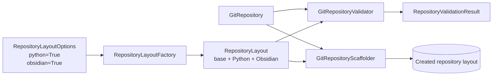

```mermaid
flowchart LR
    %% User-facing configuration
    options["RepositoryLayoutOptions<br/>python=True<br/>obsidian=True"]

    %% Layout composition
    factory[RepositoryLayoutFactory]
    layout["RepositoryLayout<br/>base + Python + Obsidian"]

    %% Repository input
    repo[GitRepository]

    %% Services
    validator[GitRepositoryValidator]
    scaffolder[GitRepositoryScaffolder]

    %% Outputs
    result[RepositoryValidationResult]
    fs[(Created repository layout)]

    options --> factory --> layout

    repo --> validator
    layout --> validator
    validator --> result

    repo --> scaffolder
    layout --> scaffolder
    scaffolder --> fs
```