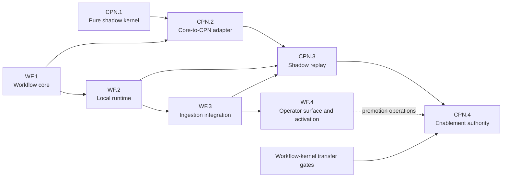
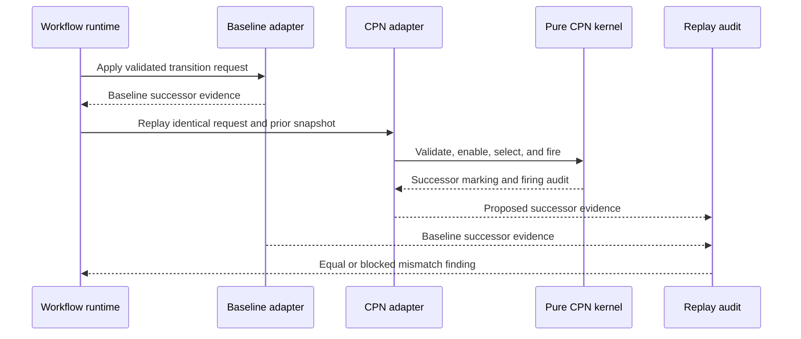
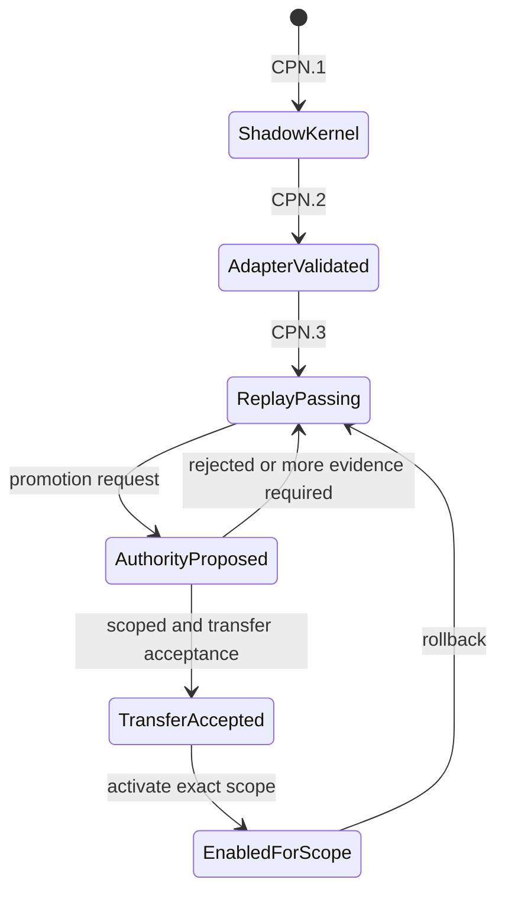
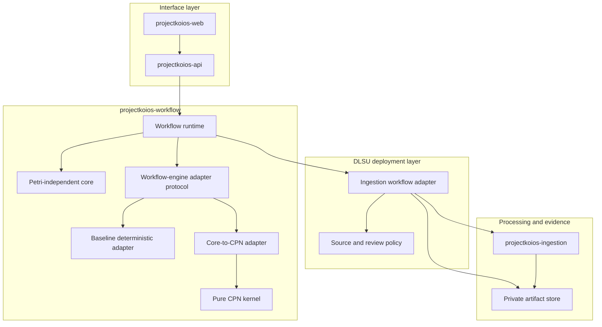
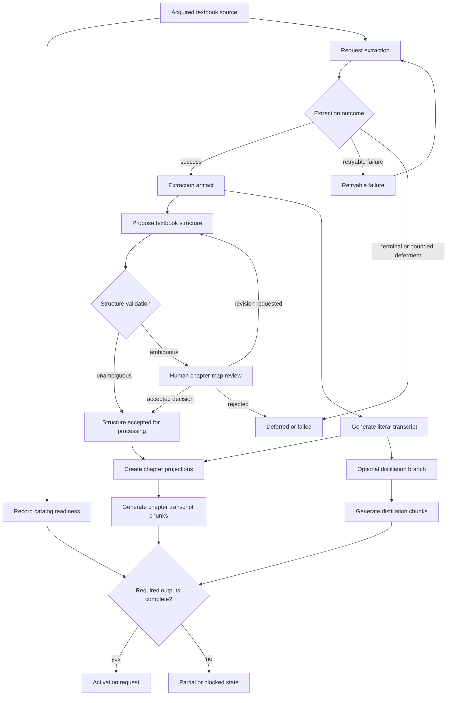
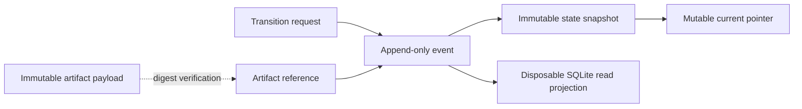
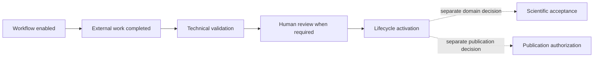

# ADR20260920: Workflow and colored-Petri-net development tracks

## Status

Accepted

Accepted by the Project Koios operator for `WORKFLOW-TRANSFER-01` on
2026-09-20. This decision accepts the WF/CPN sequencing, ownership boundaries,
and dependency gates in this record. It does not accept a component contract,
the separate workflow-kernel ownership transfer, a merge, release, migration,
or CPN authority.

## Context

Project Koios needs reusable workflow execution for document ingestion, human
review, recovery, and later scientific processes. The workflow domain must not
be coupled to one execution formalism.

`projectkoios-workflow` currently contains a proposed Petri-independent core
contract and a non-authoritative colored-Petri-net shadow kernel. The shadow
kernel provides pure definitions, markings, validation, enablement, binding
selection, firing, and firing audits. It does not provide workflow-run
persistence, external dispatch, a core-to-CPN adapter, or production authority.

The DLSU textbook-ingestion work provides a bounded first operational consumer.
It needs resumable processing, immutable artifact references, explicit chapter
review, and failure isolation without moving PDF extraction or deployment policy
into the workflow repository.

The existing
[staged workflow-kernel transfer](adr.20260918.workflow-kernel-transfer.md)
continues to govern ownership transfer from `ksdft2effmass`. This record refines
development sequencing; it does not bypass that transfer's identity/wire,
managed-project, consumer-replay, migration, rollback, or acceptance gates. If
accepted, this record also refines only the earlier proposal's issue-timing
policy: downstream owner tasks may exist early when they remain explicitly
blocked on their dependency gates.

## Decision

Project Koios will use two coordinated but independently gated development
tracks:

- `WF.1` through `WF.4` build the engine-neutral workflow capability; and
- `CPN.1` through `CPN.4` build the optional colored-Petri-net capability.

These labels identify roadmap work packages. They are not package versions,
contract versions, release identifiers, or substitutes for owner-repository
issue identities.

Solid arrows are dependency gates. The dotted WF.4-to-CPN.4 arrow records a
future operator-surface integration point, not a current implementation
dependency or authority grant.

A workflow run remains meaningful without a CPN backend. CPN capability enters
through an adapter and cannot leak Petri-specific types into workflow core,
ingestion, API, or browser contracts.

## Workflow track

### WF.1 — Petri-independent workflow core

**Formal task:**
[`WORKFLOW-CORE-01`][workflow-core-01]

WF.1 owns immutable, engine-neutral records and pure transition processing for:

- workflow-definition references;
- workflow runs and state snapshots;
- transition requests and outcomes;
- public adapter-free structural preflight;
- expected revisions and conflicts;
- artifact, decision, and authority references;
- bounded audit events; and
- deterministic replay from supplied adapter evidence.

WF.1 performs no persistence, dispatch, filesystem operation, extraction,
scientific calculation, human decision, authority authentication, or CPN
selection. A `WorkflowAuthorityReference` denotes evidence verified by its
owning policy. The core checks deterministic subject and operation binding only;
a valid preflight result does not independently authorize external work.

**Gate:** the core contract and implementation demonstrate nominal identities,
adapter-free fail-closed preflight, deterministic successor state, structural
authority binding, and no dependency on CPN or application packages. An owning
runtime or application policy remains responsible for authenticity, expiry,
revocation, and applicability before dispatch.

### WF.2 — Local runtime

**Proposed formal task:**
[`WORKFLOW-RUNTIME-01`][workflow-runtime-01]

WF.2 provides outer-layer operational services:

- append-only run events and immutable snapshots;
- optimistic expected-revision updates;
- idempotent task requests;
- worker claims and bounded leases;
- retry and terminal-failure records;
- crash recovery and replay;
- deterministic occurrence ordering;
- artifact-reference verification; and
- disposable SQLite read projections.

The runtime calls core preflight and verifies owning-policy authority before any
external dispatch. Adapter integration uses two stages: deterministic planning,
then separately authorized effect execution that returns bounded immutable
evidence for final core processing. The runtime does not embed PDF bytes,
transcript text, or private paths in workflow state.

**Gate:** malformed, stale, unknown-operation, terminal, and structurally
mismatched-authority requests are rejected before effects; an interrupted run
resumes without duplicate external effects; stale requests conflict rather than
overwrite; and replay reconstructs the same current state.

### WF.3 — Ingestion integration

**Ingestion-side contract task:**
[`INGEST-WORKFLOW-ADAPTER-01`][ingest-workflow-adapter-01]

WF.3 coordinates the first deployment-owned workflow adapter. The linked task
owns ingestion requests, results, provenance, adapter-facing contracts, and
synthetic fixtures; it does not own the executable composition adapter. Before
implementation, the deployment adapter's final code owner must be recorded. It
coordinates `projectkoios-workflow` and `projectkoios-ingestion` without either
reusable package importing the other.

The initial pilot uses two selected acquired textbook source identities without
placing filenames, source paths, or artifact payloads in public workflow
records. It coordinates:

- source-policy evidence;
- extraction;
- textbook-structure proposals;
- chapter-map validation and review;
- literal transcript generation;
- chapter projections;
- transcript chunk generation; and
- optional distillation branches.

Each unique source receives an independent document run. Accepted chapter plans
may create bounded child runs. Collection activation remains a separate parent
run.

**Gate:** both textbook runs complete or retain truthful partial/blocked states,
all outputs are immutable artifact references, and a simulated failure can be
retried without duplicating artifacts.

### WF.4 — Operator surface and activation

**Workflow-contract task:**
[`WORKFLOW-OPERATIONS-01`][workflow-operations-01]

The linked task owns transport-neutral workflow commands and read-model
semantics. It does not own HTTP representation, API authorization integration,
or browser interaction. Implementation tasks for those concerns remain in
`projectkoios-api` and `projectkoios-web` and are created only after the
transport-neutral contracts are ready.

WF.4 exposes read models and explicit commands through the API and laptop web
application:

- run and stage status;
- failures and retry eligibility;
- chapter-map review;
- decision capture;
- artifact lineage;
- replay results; and
- collection activation.

The browser accesses workflow and artifact state only through
`projectkoios-api`. A UI action creates a transition request; it does not mutate
a run or artifact directly.

**Gate:** operator actions are revision-bound, review decisions are explicit,
private paths remain server-side, recovery is tested, and collection activation
requires its own validated request.

## Colored-Petri-net capability track

### CPN.1 — Pure shadow kernel

**Formal task:** `WORKFLOW-CPN-SHADOW-01`

CPN.1 is the existing non-authoritative implementation under
`projectkoios.workflow.petrinet.colored`. It remains immutable conformance and
backend evidence while the later stages are developed.

It may validate and fire generic CPN definitions and markings. It may not
persist runs, invoke workers, authorize transitions, or accept domain results.

**Gate:** already implemented as a shadow pilot; production authority remains
absent.

### CPN.2 — Core-to-CPN adapter

**Formal task:**
[`WORKFLOW-CPN-ADAPTER-01`][workflow-cpn-adapter-01]

CPN.2 maps bounded workflow concepts into exact CPN evidence:

- workflow operation identities to transition identities;
- engine-neutral state references to compact colored tokens;
- state snapshots to markings;
- artifact and decision references to string-valued token references;
- core transition requests to enablement and selection inputs; and
- successful firing evidence to proposed core successor evidence.

Tokens contain opaque identities, never artifact payloads or filesystem paths.
The generic CPN kernel remains unaware of workflow, ingestion, and scientific
semantics.

**Gate:** adapter mappings are deterministic, bounded, reversible for audit, and
cannot manufacture authority or artifact evidence.

### CPN.3 — Shadow replay

**Proposed formal task:**
[`WORKFLOW-CPN-REPLAY-01`][workflow-cpn-replay-01]

CPN.3 executes the baseline workflow path and CPN path over the same validated
requests and supplied external evidence. CPN remains non-authoritative.

A mismatch creates a finding and blocks promotion. It does not rewrite the
baseline run.

**Gate:** textbook pilot transitions replay deterministically, deliberate
mismatches fail closed, and recovery replay reproduces both prior paths.

### CPN.4 — Enablement authority

**Proposed formal task:**
[`WORKFLOW-CPN-AUTHORITY-01`][workflow-cpn-authority-01]

CPN.4 permits an explicitly accepted CPN definition and adapter version to
determine workflow enablement and proposed successor state for a declared
workflow scope.

Authority is scoped by exact definition, adapter, workflow, and version.
Rollback to the baseline adapter remains available. CPN.2, CPN.3, and scoped
CPN.4 acceptance are necessary but not sufficient for production authority.
Before `WORKFLOW-TRANSFER-ACCEPTANCE-01`, the copied kernel remains a
non-authoritative shadow and cannot reach `EnabledForScope`.

The separate transfer program must first accept its managed-project adapter,
identity/wire policy, consumer replay, coexistence authority, release and
rollback procedure, production transfer, and applicable consumer migration.
Those decisions must cover the exact kernel and adapter version proposed for
CPN.4.

**Gate:** separate human acceptance binds the exact replay evidence, scope,
release, and rollback plan, and the applicable workflow-kernel transfer gates
and transfer acceptance are complete.

## Engine and application boundaries

Dependency arrows represent calls or supplied protocols, not ownership
transfer. `projectkoios-workflow` does not import ingestion or deployment code.
The deployment adapter does not move extraction behavior into workflow state.

## Textbook-ingestion pilot

The initial WF.3/CPN.3 pilot uses one document run per unique source. Catalog
availability remains independent of extraction success.

`Structure accepted for processing` means only that the chapter map may drive
bounded derivations. It does not make the extraction proofread, the metadata
canonical, or the source scientifically accepted.

## Workflow persistence and artifact references

The runtime stores bounded workflow evidence under the configured private data
root. Large artifacts remain in their owning artifact store.

SQLite is a query projection, not historical authority. Workflow records refer
to artifacts by typed identity and digest; they do not duplicate protected
content.

## Authority boundaries

Workflow enablement, execution success, technical validation, human review,
scientific acceptance, and publication authorization remain separate.

Neither WF.4 nor CPN.4 automatically grants scientific or publication
authority. CPN.4 grants only scoped workflow enablement and successor-state
calculation.

## Task and publication policy

- Owner-repository issues use the formal task identities listed above.
- `WF.*` and `CPN.*` remain cross-repository roadmap labels.
- Private paths, source excerpts, decisions, and run payloads do not enter
  public task records.
- Downstream issues may be created early only when they declare their blocked
  state and exact dependency gates; implementation waits for those gates.
- No workflow or CPN stage is accepted merely because code or tests exist.
- Commits, publication, migration, and authority promotion remain separately
  authorized actions.

## Consequences

- Workflow runtime can progress without waiting for CPN authority.
- The CPN kernel gains a concrete consumer without absorbing ingestion policy.
- Textbook ingestion provides replay, review, failure, and fan-out evidence for
  both tracks.
- The system carries two execution paths during CPN shadow replay.
- Additional contracts are required for runtime persistence, the engine-adapter
  boundary, replay evidence, and authority promotion.
- The separate transfer program still requires its managed-project,
  identity/wire, consumer replay, migration, rollback, and acceptance gates;
  this roadmap does not satisfy them implicitly.

[workflow-core-01]:
  https://github.com/eragasa/projectkoios-workflow/issues/1
[workflow-runtime-01]:
  https://github.com/eragasa/projectkoios-workflow/issues/3
[ingest-workflow-adapter-01]:
  https://github.com/eragasa/projectkoios-ingestion/issues/4
[workflow-operations-01]:
  https://github.com/eragasa/projectkoios-workflow/issues/7
[workflow-cpn-adapter-01]:
  https://github.com/eragasa/projectkoios-workflow/issues/4
[workflow-cpn-replay-01]:
  https://github.com/eragasa/projectkoios-workflow/issues/5
[workflow-cpn-authority-01]:
  https://github.com/eragasa/projectkoios-workflow/issues/6
