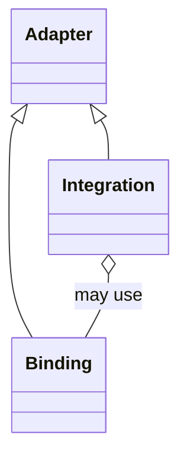

# Project Koios adapter architecture

## Purpose

Adapter is the architectural set for maintained boundaries between Project
Koios behavior and another code, protocol, application, or service surface.
This document defines two named adapter subsets needed by reusable capability
repositories:

- a **binding** adapts an imported or deliberately vendored code dependency;
- an **integration** adapts an external application or service.

These terms do not replace every existing specialized adapter term. API,
deployment, workflow, persistence, and projection adapters retain their
accepted meanings until their own contracts are reviewed.

The adapter role `Binding` also does not replace a colored-Petri-net transition
binding or a contract field that binds an implementation identity. Those
bounded contexts retain their formal meanings and do not inherit from
`Adapter`. Use "dependency binding" where prose would otherwise be ambiguous.

## Nominal hierarchy



`Adapter`, `Binding`, and `Integration` are nominal architecture roles. The
diagram expresses documentation taxonomy; it does not require runtime base
classes. Adapter membership does not imply a generic `adapt()` method. A base
class exists only after a real consumer, shared invariant, caller, and owner are
demonstrated.

Project Koios uses base classes for demonstrated runtime "is-a" relationships
and composition for "has-a" relationships. The current unused behaviorless
nominal base has no runtime owner and is not an extraction target.

## Bindings

A binding adapts code Project Koios imports as a declared dependency or copies
selectively under recorded provenance. It may own:

- package, repository, revision, tree, and license identity;
- selected source-file or subtree identity;
- dependency API translation;
- vendored-code attribution and documented local modifications; and
- compatibility behavior required by a maintained caller.

A binding does not grant authority to invoke an external application or
service.

## Integrations

An integration adapts an external application or service. It may own:

- application or service identity and version evidence;
- authentication or executable selection;
- typed requests and results;
- workspace, artifact, timeout, retry, and rate-limit boundaries;
- explicit remote or process effects; and
- interpretation of external completion evidence.

An integration remains responsible for its external effect even when it uses a
client-library binding.

## Composition example

A GitHub capability may contain both roles:

```text
GitHubIntegration
└── has PyGithubBinding
```

The PyGithub binding isolates the imported package API. The GitHub integration
owns authentication, network requests, rate limits, retries, and remote
mutation authority. The classes may share a provider repository while retaining
separate contracts.

Likewise, PyFlamestk and PyPosPack are code-facing bindings. LAMMPS and VASP are
external scientific-application integrations.

## Repository and namespace ownership

Repository placement follows the owning domain and is not determined by the
adapter role. Neutral simulation abstractions and provider integrations belong
to `projectkoios-simulations`; application composition belongs to
`projectkoios-applications`. Other capability owners may contribute adapter
leaves when their current architecture assigns that responsibility. The
taxonomy does not require one repository per provider or one repository per
adapter leaf.

The Python namespace records architectural role:

```text
projectkoios.adapters.bindings.pygithub
projectkoios.adapters.integrations.github
projectkoios.adapters.bindings.pyflamestk
projectkoios.adapters.bindings.pypospack
projectkoios.adapters.integrations.lammps
```

One owner repository may contribute more than one adapter leaf. Shared
namespace levels remain implicit namespace packages. They do not aggregate all
implementations through `__init__.py`; provider leaves may expose deliberate
facades or composition roots.

The word "external" is reserved for contribution or governance classification
when repository ownership needs that distinction. It is not a synonym for
integration.

## Frankenstein incubation overlay

`projectkoios.frankensteins` may mirror an intended Project Koios namespace so
a bounded module can be reviewed against a possible final path. Mirroring does
not accept a module or make migration automatic. After explicit owner review,
an accepted transfer normally removes only the incubation segment:

```text
projectkoios.frankensteins.adapters.bindings.pypospack
    -> projectkoios.adapters.bindings.pypospack

projectkoios.frankensteins.adapters.integrations.lammps
    -> projectkoios.adapters.integrations.lammps
```

A transfer candidate must preserve its reviewed contract, dependency direction,
tests, documentation, provenance, and license obligations. Items without a real
consumer and explicit owner remain incubated, provenance-only, or non-transfer
targets as recorded in the
[Frankenstein architecture](architecture.frankenstein.md).

## Verification boundaries

Binding conformance, integration execution, numerical verification, and
scientific validation are separate activities:

- binding tests compare maintained dependency behavior with exact source;
- integration tests verify external-system requests, effects, and evidence;
- numerical verification compares identified outputs under recorded conditions;
- scientific validation supports a separately stated scientific claim.
