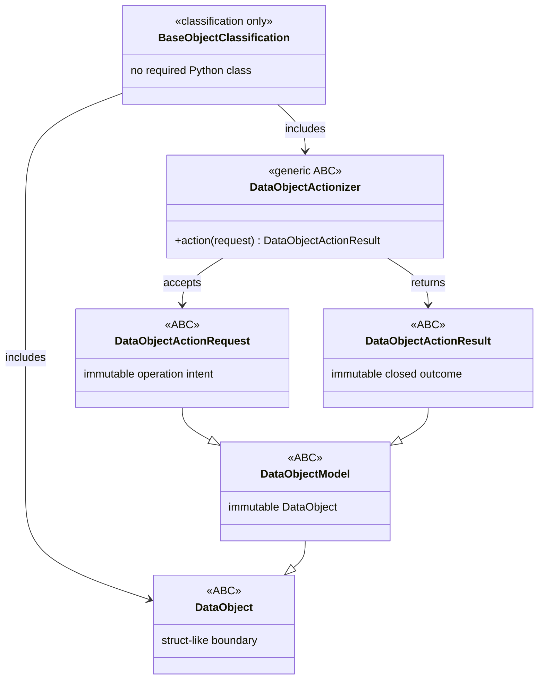

# Project Koios architecture v0

Status: **Draft**

Architecture v0 describes the intended Project Koios research platform before
its module contracts and implementation boundaries are accepted. It is a design
workspace, not implementation authority, scientific acceptance, or migration
authorization.

## Direction

Project Koios is intended to own the reusable research platform. A scientific
project such as `ksdft2effmass` should retain the scientific claims,
claim-specific interpretation, and domain-specific acceptance criteria that
make it scientifically distinct.

The extraction test is:

> Could another scientific project use this component without adopting the
> scientific claims of its source project?

If so, the component is a candidate for a Project Koios owner repository. This
does not mean that all implementation belongs in the `projectkoios` mothership.
The mothership owns cross-repository product architecture and durable domain
documents; component code remains with the applicable owner repository.

Working notes for the first source-project assessment are in the
[`ksdft2effmass` migration notes](notes/ksdft2eff-migration/index.md).

The living [evidence-grounded long-form authoring](#evidence-grounded-long-form-authoring)
section defines the first manuscript prototype and independent course reuse
test. It is a manually maintained narrative design, not a generated module
record.

## Architecture as data

Module architecture will be authored as strict JSON and rendered
deterministically to Markdown:

```text
<module>.json
    ↓ validate closed schema and cross-record invariants
    ↓ render deterministic Markdown and Mermaid
<module>.md
```

The JSON record is authoritative for represented architecture data. The
Markdown file is its human-readable projection and is never edited
independently. Both files remain version controlled so architecture is readable
without running the renderer.

This index is a bootstrap navigation and planning document. The module records
listed below will adopt the JSON-to-Markdown projection after the projection
schema and renderer exist.

## Required module-document contents

Every `docs/architecture/v0/<module>.json` record and generated `.md` projection
must include:

1. module identity, version, status, and owner;
2. purpose, responsibilities, and explicit exclusions;
3. classes, attributes, and relationships;
4. a generated Mermaid class diagram;
5. object and cross-record invariants;
6. identities, serialization, and provenance;
7. lifecycle or data-flow descriptions;
8. failure and fail-closed behavior;
9. repository and import boundaries;
10. conformance fixtures and deferred decisions.

The renderer must reject duplicate JSON members, unknown fields, duplicate
identifiers, dangling relationships, invalid cardinalities, malformed diagram
content, and output drift.

## Python object model

The default domain-operation shape is:

```text
DataObjectActionRequest → DataObjectActionizer → DataObjectActionResult
```

`BaseObject` is the architecture classification containing the struct-like
`DataObject` boundary and function-like `DataObjectActionizer` boundary. It is
not a required Python class. The five required thin public ABCs live in
`projectkoios.base`:

```text
DataObject(ABC)
DataObjectModel(DataObject, ABC)
DataObjectActionRequest(DataObjectModel, ABC)
DataObjectActionResult(DataObjectModel, ABC)
DataObjectActionizer[RequestT: DataObjectActionRequest,
                     ResultT: DataObjectActionResult](ABC)
```



### DataObject

`DataObject` is the thin ABC for struct-like represented domain state or values.
Its abstract initializer requires a concrete dataclass or explicit constructor
to provide complete state. A concrete DataObject owns intrinsic invariants and
may retain cheap, deterministic, unsurprising invariant methods and derived
properties. It does not perform filesystem, network, process, clock, or
database effects or own generic serialization, rendering, or persistence.

Boundary Pydantic models are not internal DataObjects. An adapter converts a
validated boundary model into an applicable concrete DataObject.

### DataObjectModel

`DataObjectModel` is the DataObject ABC specialization for an immutable
struct-like object. Concrete implementations normally use
`dataclass(frozen=True, slots=True)`. This name does not imply a Pydantic model,
ORM model, or machine-learning model. A separate domain-model object is needed
only when its independent identity, version, invariants, or reuse are part of
the operation contract.

### DataObjectActionRequest

`DataObjectActionRequest` inherits `DataObjectModel` and represents the complete
immutable intent for one domain operation. Its identity binds the operation
contract and version, all input DataObject identities, parameters, and any
applicable domain-model identity. It contains no live clients, stores, clocks,
open resources, results, mutable progress, or retry state.

### DataObjectActionizer

`DataObjectActionizer` is the separate function-like generic ABC. Its abstract
`action(*, request)` method accepts one typed `DataObjectActionRequest` and
returns one typed `DataObjectActionResult`. Dependencies, clocks, stores,
external clients, configuration, and authority are explicit rather than
obtained through ambient discovery.

`DataObjectActionizer` names the functional ABC and architecture role, not a
mandatory concrete suffix. An Actionizer is the noun that does the action: the
performer or agent, not the action itself and not merely a suffix
transformation. Request and result names share a coherent operation stem, such
as `ScientificMarkdownRenderRequest` and `ScientificMarkdownRenderResult`; the
implementation keeps its accurate agent noun, such as
`ScientificMarkdownRenderer`. `Composer`, `Processor`, `Reconciler`, `Executor`,
`Validator`, `Detector`, `Projector`, `Coordinator`, `Assembler`, `Recognizer`,
`Checker`, and `Ingester` are concrete Actionizer nouns when they perform their
named actions. No intermediate `FooActionizer` class exists solely to attach the
architecture label.

The inherited `action(*, request)` method is the uniform boundary. An existing
meaningful domain verb such as `compose`, `process`, `reconcile`, or `execute`
may remain the meaningful API, with one method delegating to the other and no
duplicated operation logic. Neither the meaningful implementation noun nor
semantic method is deprecated merely because the class inherits
`DataObjectActionizer`. Compatibility aliases are reserved for genuinely
superseded type names, such as an `Input` renamed to `Request`.

Within a touched bounded family, private implementation helpers attach to the
`DataObject` or concrete Actionizer that owns the invariant or action. They may
be private instance methods, `staticmethod`s, or `classmethod`s according to
whether they need instance state, class state, or neither. Private module-level
`_helper` functions and generic `Utils` or `Helpers` containers do not
accumulate. Genuinely shared behavior belongs to a narrowly named collaborator
object with one real responsibility rather than duplicated or free-floating
helpers. A public module-level function is valid only as an intentional public
entry point or factory, not as a hidden implementation helper.

### DataObjectActionResult

`DataObjectActionResult` inherits `DataObjectModel` and represents the immutable
outcome of one exact request processed under one identified actionizer contract.
It binds the request, actionizer, configuration, applicable domain model,
outputs, evidence, and closed expected outcome. Request and result identities
remain distinct because repeated processing can produce separately identified
execution evidence or outcomes.

`Result` is the internal domain term, not `Response`. Response models belong at
transport boundaries such as HTTP; an adapter maps the domain result to the
response schema. A result implies neither human acceptance, scientific
validity, publication, nor workflow authority.

Expected domain outcomes belong in a result. Programming errors and violated
caller preconditions use specific exceptions such as `TypeError` and
`ValueError`; runtime validation must not depend on `assert`. A
DataObjectActionResult remains distinct from a workflow `ResultObject` unless
an owning contract explicitly assigns both roles.

### Avoid framework machinery

The v0 design does not introduce:

- a public `BaseObject` class;
- behavior on the thin ABCs beyond their struct/function boundary;
- a universal Actionizer registry or service locator;
- reflective actionizer discovery;
- generic `to_json` or `from_json` methods on every DataObject; or
- one result wrapper that erases domain-specific outcomes.

Serialization, persistence, rendering, and comparison remain named operations
owned by their applicable modules.

## Python code policy

The authoritative Draft policy source is
[`docs/policies/code/python.json`](../../policies/code/python.json). Its
human-readable projection is
[`docs/policies/code/python.md`](../../policies/code/python.md).

The policy owns the BaseObject classification, exact thin ABC hierarchy,
DataObject, DataObjectModel, DataObjectActionRequest, DataObjectActionizer,
DataObjectActionResult, package initializer, Python, tooling, and judicious
Google Python Style Guide rules.
This architecture index records their system-level use without creating a
second independently maintained coding policy.

### Prototype persistence formats

Before a persistence format becomes external, released, or irreplaceable,
maintain one current canonical format and replace or regenerate it in place.
Do not accumulate `V1`, `V2`, generation, schema-version, compatibility, or
migration formats for pre-durability prototypes. Strict closed-shape
validation, applicable content hashes, and deterministic identities remain
required; Git preserves superseded prototype history.

Freeze the first numbered format only at an explicit durability boundary. A
format that is already external, released, or irreplaceable instead requires
explicit versioning, compatibility, and migration policy and must not be
silently replaced in place.

The policy projection has one bounded executable sequence:

```bash
python3.14 -m tools.render_python_policy --write
python3.14 -m tools.render_python_policy --check
pytest -q tests/projectkoios/test__base.py \
  tests/tools/test__PythonPolicyProjection.py \
  tests/schemas/test__SchemaCatalog.py
```

The renderer has fixed repository-local inputs
`docs/policies/code/python.json` and `python.schema.json`, and its only writable
output is `python.md`. It rejects non-regular or symlinked inputs, inputs over
one megabyte, duplicate JSON members, invalid JSON constants, a non-object
root, and schema-invalid policy data before rendering or writing. `--check`
performs no write and fails on byte drift. The tool is intentionally reusable
only for this Python-policy shape; it is not an architecture renderer, a generic
policy framework, a schema-catalog replacement, or a workflow engine.

## Initial module records

| Module | Responsibility | Planned owner |
|---|---|---|
| `architecture-document` | Closed JSON architecture model, BaseObject classification, thin DataObject/actionizer ABCs, validation, Mermaid generation, and deterministic Markdown projection | `projectkoios` documentation tooling |
| `scientific-markdown` | Source-anchored scientific Markdown, equations, figures, assets, and provenance | `projectkoios-ingestion` |
| `citation-graph` | Citation occurrences, bibliography occurrences, canonical mappings, links, and derived backlinks | `projectkoios-references` |
| `markdown-chunking` | Markdown-AST-aware chunks, source-map retention, content roles, and purpose admission | `projectkoios-search` |
| `transcript-review-api` | Opaque, bounded API projection over Markdown and authoritative source evidence | `projectkoios-api` |
| `transcript-review-ui` | Markdown-first reading and evidence-inspection experience | `projectkoios-web` |

The owner column records the intended implementation boundary. Cross-repository
architecture remains documented here.

## Ingestion implementation handoff

This handoff defines taxonomy and package-shape obligations; it does not
authorize changes in `projectkoios-ingestion`.

### Required migration rules

1. Use the exact thin ABC hierarchy from `projectkoios.base` for materially
   changed shared operation boundaries. `DataObject` and
   `DataObjectActionizer` are both BaseObject classifications, but no public
   `BaseObject` class exists or is required.
2. Give each materially changed operation coherent Request and Result names
   with one domain-operation stem, and retain `Result` for the internal outcome.
   Let the concrete actionizer keep its accurate performer/agent noun rather
   than adding an `Actionizer` suffix or an intermediate `FooActionizer` label
   class. Use `Response` only for a transport model produced by a boundary
   adapter.
3. Implement requests and results as immutable `DataObjectModel` subclasses
   with distinct identities. Bind exact DataObject inputs and any independently
   meaningful domain-model object in the request; bind request, actionizer,
   configuration, outputs, and execution evidence in the result.
4. Preserve valid cheap invariant methods, derived properties, implementation
   nouns, semantic operation methods, and existing domain semantics. Supply
   `action(*, request)` by delegating in one direction when a semantic method
   remains; do not duplicate logic, deprecate meaningful behavior names, or
   perform a mechanical repository-wide rewrite. Attach touched private helpers
   to their owning object; use a narrowly named collaborator for genuinely
   shared behavior rather than module `_helper` functions or generic utility
   containers.
5. Move implementation bodies out of package and subpackage `__init__.py`
   files into cohesive named modules. Keep initializers empty or limit them to
   small explicit facades with aligned `__all__` declarations.
6. Treat initializer implementation extraction and facade narrowing as separate
   migrations. Moving implementation may retain existing import paths through
   explicit re-exports; removing a re-export requires consumer inventory,
   compatibility tests, and an explicit deprecation window or authorized
   versioned breaking release.
7. Run the ingestion owner's focused tests, package export tests, lint, type
   checks, and full maintained validation after each bounded migration.
8. For prototype persistence formats that have not crossed an external,
   released, or irreplaceable durability boundary, keep one current canonical
   format and regenerate it in place; do not create numbered generations or
   migrations. Preserve strict shape, hashes, deterministic identities, and
   Git history.

### Optional observations, not numeric targets

The owner inventory observed the current root `projectkoios.ingestion`
initializer at 966 lines, 448 exports, and 35 import blocks. It also observed
substantial implementation in `figures/__init__.py` (1,659 lines, 18 classes,
39 functions), `tables/__init__.py` (1,634 lines, 18 classes, 39 functions),
`layout/__init__.py` (1,041 lines, 9 classes, 13 functions), and
`provenance/__init__.py` (586 lines, 10 classes). In contrast, the article and
textbook initializers are small 11-line APIs, while the PDF initializer is 77
lines with 32 exports. These September 2026 counts locate review candidates
only. They are not thresholds, acceptance criteria, desired export counts, or
permission to remove an API.

A separate domain-model object is optional. Introduce one only where model
identity, version, invariants, or reuse are independently meaningful; keeping
model parameters directly on a request is valid otherwise. All immutable
requests and results still inherit the `DataObjectModel` ABC. Likewise, a small
pure transformation need not acquire an actionizer class unless it is exposed
as that boundary.

### Stop conditions

Stop and return to the architecture owner when the three terms cannot describe
the operation without changing product semantics, when a proposed model
boundary requires a new domain decision, when it is unclear whether a persisted
format is already external, released, or irreplaceable, when the owning
distribution cannot declare the `projectkoios.base` dependency without a
packaging decision, or when compatibility cannot be preserved without a
separately approved breaking change. Stop and return to the applicable repository owner before changing
implementation outside `projectkoios-ingestion`. No migration step may silently
delete exports,
automatically rewrite the repository, or infer scientific acceptance.

## Scientific Markdown pipeline

The intended evidence and retrieval chain is:

```text
authoritative PDF
    ↓
source-anchored evidence records and immutable assets
    ↓
immutable scientific Markdown
    ↓
Markdown-aware chunks
    ↓
purpose-scoped search projections
    ↓
API-backed reading and review UI
```

The PDF remains the source authority. The published `.md` file is the immediate
input to chunking and retrieval. Supporting machine-readable records map the
Markdown back to source pages, regions, blocks, equations, figures, citations,
and bibliography entries.

Changing the Markdown creates a new Markdown identity, new chunk identities,
and a new search projection. It does not mutate an earlier content-identified
artifact.

## Source-page identity

Page position and printed numbering are distinct:

- `page_index`: zero-based extractor position;
- `physical_pdf_page`: one-based PDF viewer page, equal to
  `page_index + 1`;
- `printed_page_label`: the exact page label printed by the source, including
  Arabic numbers, Roman numerals, appendix labels, or explicit absence.

Source links navigate by physical PDF page while displaying both physical and
printed identities. Printed labels are never inferred solely from an offset.

## Equation identity and numbering

Equations retain their exact printed source label and an independently resolved
canonical label. When numbering restarts at a chapter boundary, the canonical
label is chapter-qualified as `chapter.equation`.

Examples include `20.1`, `20.3a`, and `B.7`. An unnumbered or ambiguous equation
remains explicitly unresolved rather than receiving an invented label.

Equation content identity is independent of its readable number. References to
an equation are represented as edges to that equation occurrence, and reverse
backlinks are derived from those edges.

## Markdown chunking constraints

Chunking operates on the exact published Markdown bytes, not directly on the
PDF or an internal document graph. The chunker must be Markdown-AST-aware and
must preserve complete structural units.

It must not split:

- fenced or display-equation blocks;
- an equation from its number;
- a figure from its exact caption;
- citation syntax from its containing sentence;
- one bibliography entry; or
- machine-readable source-boundary markers.

Exact source-derived content and generated contextual descriptions must retain
separate content roles. Generated descriptions remain visibly marked
`AUTOMATED_UNREVIEWED` and cannot silently become citation evidence.

## Citation and backlink structure

Canonical relationships are stored once. For example, a citation occurrence
has one edge to a bibliography occurrence. Backlinks are reverse projections of
that edge rather than independently maintained authority.

Bibliography-to-canonical-reference mapping remains separately resolvable as
linked, ambiguous, or unresolved. Resolution fails closed and never invents an
entry or identifier.

## Architecture projection requirements

The architecture renderer will reuse and repackage applicable deterministic
projection techniques already developed in `ksdft2effmass`, including:

- strict JSON and duplicate-member rejection;
- Draft 2020-12 JSON Schema validation;
- immutable input and output identities;
- explicit projection profiles;
- exact UTF-8 Markdown bytes;
- byte-identical replay and drift checking;
- valid and invalid conformance fixtures; and
- resource-manifest identities.

The Project Koios implementation will remove source-project Task, chain,
activation, scientific-domain, SQLite, and harness-state semantics. Extraction
uses pinned committed source blobs, not an uncommitted working tree.

## Initial delivery sequence

1. Inventory the reusable committed `ksdft2effmass` projection assets.
2. Define the closed architecture-document JSON schema.
3. Repackage the strict loader, validator, renderer, and drift checker.
4. Add valid, invalid, exact-byte, and Mermaid conformance fixtures.
5. Represent `scientific-markdown` as the first architecture JSON record.
6. Generate its Markdown and verify byte-identical replay.
7. Represent citation, chunking, API, and Web modules only after the first
   projection proves the format.

## Evidence-grounded long-form authoring

### Status and classification

This is the living narrative v0 design for a bounded authoring prototype.
It is maintained directly in this index rather than represented as a generated
module record. It is not an accepted contract, implementation authorization,
source-use authorization, or scientific or pedagogical acceptance.

The first prototype is one bounded `ksdft2effmass` manuscript section. A
reference-grounded course-note explanation is the independent reuse test. The
design deliberately avoids building a workflow system, publication system, or
generalized writing agent during the prototype.

### Goal

Project Koios should help an author draft scientific manuscripts and course
notes from multiple references while preserving inspectable evidence and human
control.

```text
reference evidence -> retrieval -> draft proposal -> human author
```

The responsibilities remain separate:

- **References** records bibliographic identity, observed source assets, and
  access or rights evidence. It does not authorize a particular use.
- **The author or domain owner** authorizes the purpose-specific local use of
  selected sources.
- **Ingestion** produces content-identified extraction and canonical-transcript
  records with page and block lineage. It does not attach references or write
  prose.
- **Search** composes bounded evidence items and retrieves them. It does not
  answer or decide whether evidence supports a claim.
- **Generation** proposes text and citations. It does not edit the target.
- **The author or principal investigator** retains scientific, editorial, and
  pedagogical acceptance authority.

### Non-negotiable boundaries

1. Source bytes remain unchanged and content-identified.
2. Every retrieved item resolves to an observed reference/asset linkage and
   retained extraction evidence.
3. The manuscript or course note is query context, never evidence for itself.
4. Generated prose and earlier model answers never enter the source-evidence
   index.
5. A retrieval score does not establish support, truth, or acceptance.
6. Missing or inadequate evidence is reported rather than invented.
7. Conflicting sources remain visible.
8. The first prototype uses local inference and sends no source or target text
   to a remote provider.
9. The model receives no filesystem, shell, database, browser, or publication
   tools. Retrieved text is untrusted quoted data and cannot issue instructions.
10. A model never writes directly to a manuscript, bibliography, or course.
11. Structural checks do not establish mathematical, scientific, editorial, or
    pedagogical correctness.
12. Private paths and protected excerpts do not enter public logs or fixtures.
13. Prototype data has one current canonical shape. Derived artifacts are
    regenerated when that shape changes; Git retains earlier designs.

### Smallest useful architecture

#### Source admission

Before ingestion or retrieval, the prototype must have:

- a stable bibliographic work identity and its authority status;
- an observed source-asset identity;
- the References-owned linkage between the work and asset;
- access and rights observations; and
- an explicit purpose-specific local-use authorization from the author or
  domain owner.

References supplies evidence; it does not make the use decision. Source
admission reports `REFERENCE_IDENTITY_UNRESOLVED`, `DISCOVERY_INCOMPLETE`,
`ASSET_INACCESSIBLE`, `RIGHTS_UNKNOWN`, `USE_NOT_AUTHORIZED`, or
`INGESTION_MISSING` as distinct typed failures before retrieval. Do not collapse
them into “source unavailable” or `INSUFFICIENT_EVIDENCE`.

#### Transcript admission

Ingestion reports extraction identity, canonical transcript, page/block
lineage, transformations, warnings, and derivation-audit results. The authoring
owner decides fitness for the selected use.

The minimal fail-closed gate requires:

- matching source and transcript identities;
- passing lineage/derivation consistency checks;
- resolvable page and block lineage for every selected item;
- retained extraction text and transformation mapping; and
- block-resolvable warning details.

Baseline automated/unreviewed warnings and zero/nonzero warning counts are not
quality decisions. A warning affecting selected evidence requires page
inspection or exclusion. A passing audit proves internal consistency, not
extraction accuracy.

#### Evidence item

The first prototype uses text evidence only. An evidence item carries:

- stable bibliographic work identity and candidate/accepted authority status;
- optional accepted canonical citekey;
- exact source-asset and transcript-result identities;
- page identity/index and printed label when available;
- clean-transcript block record identity and retained source-span tuple;
- indexed search text and its digest;
- exact retained extraction text, or an explicit transformation mapping, and
  its digest;
- extraction/transformation warnings; and
- a deterministic evidence-item identity derived from those values.

Block-level resolution is sufficient initially. Do not invent character offsets
until an indexer can validate them. A page-navigation locator is not a text-span
locator.

Normalized clean text may improve retrieval but is not quote-authoritative.
Quote checks resolve to exact retained extraction text or an explicit
transformation mapping. This validates retained extraction, not ground-truth PDF
wording; page evidence and warnings remain visible.

Bundle-local labels such as `E1` are presentation only. Ranking ties, citation
mappings, and replay use the deterministic evidence-item identity.

Typed figure, table, and equation retrieval are deferred until a concrete
writing need and fixture demonstrate their value.

#### Evidence query

Search receives no manuscript or course bytes. A query binds:

- one purpose;
- a bounded query representation produced by the domain composer;
- an opaque target identity;
- optional bounded bibliographic-work filters; and
- fixed limits.

The implementation fixes maxima for query characters, opaque identity length,
filter count and identity length, result count, per-work count, per-item indexed
and retained text, warning count and length, and aggregate bundle text. Exact
constants belong to implementation and tests, not a parallel format.

The first purpose is `manuscript_authoring`. Course-purpose generalization waits
for the independent course slice.

#### Evidence bundle

Search returns a bounded bundle containing:

- request and exact corpus/index identity;
- ordered ranked evidence items;
- lexical scores, ranks, matched terms, and tie keys;
- warnings, applied bounds, omissions, and truncation; and
- exactly one outcome:
  - `EVIDENCE_AVAILABLE`;
  - `INSUFFICIENT_EVIDENCE`;
  - `INVALID_REQUEST`; or
  - `INFRASTRUCTURE_FAILURE`.

`INSUFFICIENT_EVIDENCE` is mechanical: a valid completed search over the
admitted corpus selected no item satisfying documented lexical, filter, and
bound rules, or an explicitly required work was absent. A reviewer deciding
that returned evidence does not support a claim is not a Search insufficiency
outcome. Unsupported capability, malformed bounds, corrupt indexes, and
unexpected defects are never relabeled as insufficiency.

The bundle is evidence presented to a writer. It is not an answer and does not
claim entailment.

#### Deterministic multiple-reference selection

The prototype:

1. globally orders eligible items by lexical score, then stable evidence-item
   identity;
2. always retains the strongest eligible item;
3. fills remaining slots in that order while enforcing a per-work cap;
4. defines “source diversity” by bibliographic work identity, not asset,
   transcript, or passage identity;
5. records omissions caused by caps or aggregate limits; and
6. reports a missing explicitly requested work rather than silently
   substituting another.

Different assets or versions of one work remain visible but do not count as
independent references. No fusion lane is required.

#### Draft proposal

The domain composer retains target context privately, enforces a fixed maximum
context size, and sends Search only the bounded query representation and opaque
target identity. It gives the generation component the bounded target context
and one evidence bundle separately.

The generated proposal contains:

- proposed text;
- citation markers mapped to evidence-item identities;
- optional existing manuscript citekey plus status: accepted, prospective, or
  missing;
- statements explicitly marked unsupported or partial;
- conflicts and qualifications; and
- model and prompt identity sufficient to inspect the run.

Generation may emit an accepted canonical citekey supplied by References. It
must not turn a candidate/proposed key into a citation. When no accepted key
exists, it reports an unresolved bibliographic-identity gap. The target owner
compares accepted keys with the supplied target bibliography snapshot.

The initial output is a bounded local review file or terminal artifact, not a
new database. The author manually accepts, rejects, or copies material. A richer
claim ledger, automated patch application, persistent review records,
publication receipts, and workflow orchestration are later capabilities, not
prerequisites.

### Retrieval strategy

Use deterministic BM25 or an equivalent documented full-text baseline before
embeddings. Record tokenization, scoring, limits, and tie breaking. Add semantic
retrieval only if a fixed benchmark demonstrates useful improvement.

A text-only lexical slice may answer an equation-oriented question only from
inspectable retained text. If the claim requires an equation representation,
the domain composer reports deferred modality and emits no equation-backed
prose. Rendering, reconstruction, and equivalence remain later work.

Curated notes may help discovery in a future slice, but final literature support
resolves to independent reference evidence.

### Ownership and dependency direction

| Concern | Owner |
|---|---|
| Cross-repository architecture and use cases | `projectkoios` |
| Bibliographic identity, observed assets, linkage, and rights evidence | `projectkoios-references` |
| Extraction, canonical transcript, and page/block lineage | `projectkoios-ingestion` |
| Evidence items, lexical retrieval, and evidence bundles | `projectkoios-search` |
| Manuscript target parsing and repository-local checks | `ksdft2effmass` |
| Course structure, objectives, and repository-local checks | `projectkoios-courses` |
| Scientific/editorial/pedagogical acceptance | Author, principal investigator, or designated human authority |

`ksdft2effmass` is the temporary composition root for the manuscript prototype;
`projectkoios-courses` is the temporary composition root for the course slice.
They call reusable owners in the direction References -> Ingestion -> Search.
Reusable owners never import either domain repository.

Do not involve `projectkoios-agent`, `projectkoios-applications`,
`projectkoios-workflow`, the API, or the Web merely to complete the first local
slice. The first two domain composers remain local. Shared generation behavior
moves to `projectkoios-agent` only after independent reuse demonstrates the
same useful boundary.

### Optional manuscript structural guard

A repository-local LaTeX auditor is not assumed to exist. If one is present at
prototype time, apply only its documented implemented checks to a staged copy.
Those checks may include include containment, missing includes, duplicate
labels, or unresolved references. Do not require repository-specific structure
unless its contract actually exists.

Passing such an audit means only that the checked structure satisfies its
software rules. It does not establish correct mathematics, adequate citations,
scientific support, authorship, or publication readiness.

### First prototype

Use one manuscript subsection and a small authorized reference set:

1. Admit selected works/assets and canonical transcript blocks through the
   gates above.
2. Build a deterministic lexical index.
3. Ask one author-supplied question about one target passage.
4. Return a small evidence bundle from multiple bibliographic works.
5. Generate one paragraph or short subsection proposal with evidence-linked
   citation markers and explicit unsupported statements.
6. Validate that markers resolve to bundle items, quotations resolve to retained
   extraction text, and target citekey status is explicit.
7. Optionally run an implemented repository-local structural check on a staged
   copy.
8. Present the proposal and evidence to the author.
9. Stop without editing the manuscript.

The prototype succeeds when the author can inspect why each citation was
proposed and can see missing, partial, or conflicting evidence.

### Reference-grounded course reuse test — Courses Option A

After the manuscript slice works, repeat the pattern for one bounded explanatory
prose block tied to one course-owned learning objective.

`lecture_authoring` is default-deny. The first course slice admits only
independently validated `theory_evidence` from independent references. It has no
cross-purpose fallback. Worked examples, exercises, existing course notes, model
answers, and every source/generated/reviewed solution role remain owner-local
context and are not Search evidence items. A worked example becomes eligible
only in a later policy and only when it is source-linked text from an admitted
independent reference.

The course-owned objective identity plus exact text/revision stays in target
context and proposal provenance. Search neither owns nor infers the objective.
The course author assesses alignment.

Use one fixed course case containing expected theory and at least one excluded
example or solution passage. Record expected admitted evidence and the course
author's usefulness/revision assessment. This is a reference-grounded test, not
full integration of atomic notes.

Only source-evidence, retrieval, insufficiency, conflict, and proposal
provenance behavior is a candidate for sharing.

### Prototype evaluation

Fix a small benchmark before testing:

- directly supported and paraphrased needs;
- a partially supported claim;
- conflicting sources;
- a missing intended work;
- a text-resolvable equation-oriented question;
- an equation request requiring deferred modality; and
- a deliberately zero-hit lexical request.

Measure whether expected evidence appears, locators and retained quotations
resolve, ranking replays, citations use only bundle items, unsupported material
stays visible, and the author finds the proposed paragraph useful without
excessive revision.

These are product-development signals, not scientific validation.

### Later, only when earned

Semantic/equation retrieval, note-evidence identities, persistent review,
automated patching, workflow orchestration, API/Web review, model training,
shared generation infrastructure, and publication/deployment are deferred.
Promote one only when the prototype exposes a repeated concrete failure that it
solves.

### Stop conditions

Stop when source/use authority is unclear, evidence cannot resolve to retained
extraction, selected warnings require unresolved page inspection, target text
would leave its approved boundary, retrieved content could influence tools,
the target changed, an equation representation is required, or a proposed
shared abstraction has only one real consumer.

## Boundaries

Architecture v0 does not by itself authorize:

- migration or deletion of `ksdft2effmass` code or documents;
- movement or acceptance of any scientific claim;
- private-document processing;
- scientific simulation or result interpretation;
- contract acceptance;
- production deployment or release; or
- replacement of admitted canonical transcript artifacts.

Each extraction, implementation, publication, and acceptance step remains a
separate decision.
