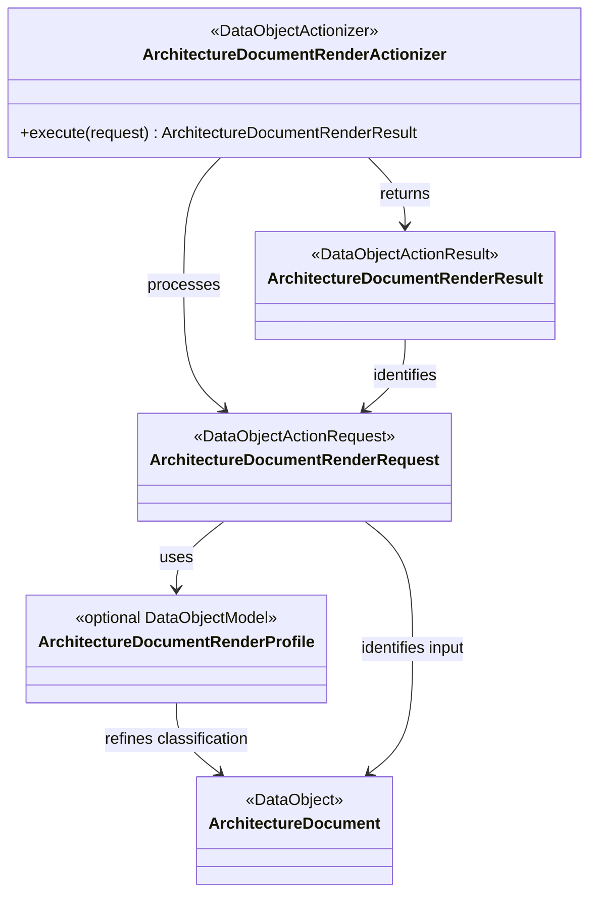

# Project Koios architecture v0

Status: **Draft**

Architecture v0 describes the intended Project Koios research platform before
its module contracts and implementation boundaries are accepted. It is a design
workspace, not implementation authority, scientific acceptance, or migration
authorization.

## Direction

Project Koios is intended to own the reusable research platform. A scientific
project such as `ksdft2effmass` should retain the scientific claims,
claim-specific interpretation, and domain-specific acceptance criteria that
make it scientifically distinct.

The extraction test is:

> Could another scientific project use this component without adopting the
> scientific claims of its source project?

If so, the component is a candidate for a Project Koios owner repository. This
does not mean that all implementation belongs in the `projectkoios` mothership.
The mothership owns cross-repository product architecture and durable domain
documents; component code remains with the applicable owner repository.

Working notes for the first source-project assessment are in the
[`ksdft2effmass` migration notes](notes/ksdft2eff-migration/index.md).

## Architecture as data

Module architecture will be authored as strict JSON and rendered
deterministically to Markdown:

```text
<module>.json
    ↓ validate closed schema and cross-record invariants
    ↓ render deterministic Markdown and Mermaid
<module>.md
```

The JSON record is authoritative for represented architecture data. The
Markdown file is its human-readable projection and is never edited
independently. Both files remain version controlled so architecture is readable
without running the renderer.

This index is a bootstrap navigation and planning document. The module records
listed below will adopt the JSON-to-Markdown projection after the projection
schema and renderer exist.

## Required module-document contents

Every `docs/architecture/v0/<module>.json` record and generated `.md` projection
must include:

1. module identity, version, status, and owner;
2. purpose, responsibilities, and explicit exclusions;
3. classes, attributes, and relationships;
4. a generated Mermaid class diagram;
5. object and cross-record invariants;
6. identities, serialization, and provenance;
7. lifecycle or data-flow descriptions;
8. failure and fail-closed behavior;
9. repository and import boundaries;
10. conformance fixtures and deferred decisions.

The renderer must reject duplicate JSON members, unknown fields, duplicate
identifiers, dangling relationships, invalid cardinalities, malformed diagram
content, and output drift.

## Python object model

The default domain-operation shape is:

```text
DataObjectActionRequest → DataObjectActionizer → DataObjectActionResult
```

A request identifies the applicable `DataObject` inputs and, only when the
domain needs one, an exact `DataObjectModel`. These names are architecture
classifications. They do not require public base classes with the taxonomy
names, inheritance used only for labeling, or a universal runtime framework.



### DataObject

A DataObject is an immutable representation of domain state, value, evidence,
or output. It should normally be a frozen, slotted dataclass. It owns intrinsic
field invariants and may retain cheap, deterministic, unsurprising invariant
methods and derived properties. It does not perform filesystem, network,
process, clock, or database effects or own generic serialization, rendering,
or persistence.

Boundary Pydantic models are not internal DataObjects. An adapter converts a
validated boundary model into an internal request or DataObject.

### Optional DataObjectModel

A DataObjectModel is an optional, more specific DataObject classification for
an independently meaningful immutable domain model used to interpret,
validate, or transform other DataObjects. Introduce it only when its identity,
version, invariants, or reuse matter to the domain contract. It is not a
mandatory wrapper, actionizer, Pydantic model, ORM model, or machine-learning
model unless the owning domain explicitly assigns that meaning.

### DataObjectActionRequest

A DataObjectActionRequest is the complete immutable intent for one domain
operation. Its identity binds the operation contract and version, all input
DataObject identities, parameters, and an optional DataObjectModel identity.
It contains no live clients, stores, clocks, open resources, results, mutable
progress, or retry state. Execution timestamps and attempt numbers therefore
do not change the identity of represented intent.

### DataObjectActionizer

A DataObjectActionizer performs one named domain operation expressed by an
exact request. It receives policy, dependencies, clocks, stores, external
clients, and authority explicitly rather than through mutable globals or
ambient discovery. It is stateless unless its documented identity includes
immutable configuration.

Concrete operation families share a domain stem, such as
`ScientificMarkdownRenderRequest`, `ScientificMarkdownRenderActionizer`, and
`ScientificMarkdownRenderResult`. A small owner-local pure transformation may
remain a typed module-level function when an actionizer boundary would add
empty machinery.

### DataObjectActionResult

A DataObjectActionResult is the immutable outcome of one exact request processed
under one identified actionizer contract. It binds the request, actionizer,
configuration, optional model, outputs, evidence, and closed expected outcome
that apply. Request and result identities remain distinct because repeated
processing can produce separately identified execution evidence or outcomes.

`Result` is the internal domain term, not `Response`. Response models belong at
transport boundaries such as HTTP; an adapter maps the domain result to the
response schema. A result implies neither human acceptance, scientific
validity, publication, nor workflow authority.

Expected domain outcomes belong in a result. Programming errors and violated
caller preconditions use specific exceptions such as `TypeError` and
`ValueError`; runtime validation must not depend on `assert`. A
DataObjectActionResult remains distinct from a workflow `ResultObject` unless
an owning contract explicitly assigns both roles.

### Avoid nominal framework machinery

The v0 design does not introduce:

- a universal DataObject superclass;
- a universal Actionizer registry or service locator;
- reflective actionizer discovery;
- generic `to_json` or `from_json` methods on every DataObject;
- inheritance used only to attach an architectural label; or
- one result wrapper that erases domain-specific outcomes.

Serialization, persistence, rendering, and comparison remain named operations
owned by their applicable modules.

## Python code policy

The authoritative Draft policy source is
[`docs/policies/code/python.json`](../../policies/code/python.json). Its
human-readable projection is
[`docs/policies/code/python.md`](../../policies/code/python.md).

The policy owns the detailed DataObject, optional DataObjectModel,
DataObjectActionRequest, DataObjectActionizer, DataObjectActionResult, package
initializer, Python, tooling, and judicious Google Python Style Guide rules.
This architecture index records their system-level use without creating a
second independently maintained coding policy.

The policy projection has one bounded executable sequence:

```bash
python3.14 -m tools.render_python_policy --write
python3.14 -m tools.render_python_policy --check
pytest -q tests/tools/test__PythonPolicyProjection.py \
  tests/schemas/test__SchemaCatalog.py
```

The renderer has fixed repository-local inputs
`docs/policies/code/python.json` and `python.schema.json`, and its only writable
output is `python.md`. It rejects non-regular or symlinked inputs, inputs over
one megabyte, duplicate JSON members, invalid JSON constants, a non-object
root, and schema-invalid policy data before rendering or writing. `--check`
performs no write and fails on byte drift. The tool is intentionally reusable
only for this Python-policy shape; it is not an architecture renderer, a generic
policy framework, a schema-catalog replacement, or a workflow engine.

## Initial module records

| Module | Responsibility | Planned owner |
|---|---|---|
| `architecture-document` | Closed JSON architecture model, DataObject/request/actionizer/result roles, validation, Mermaid generation, and deterministic Markdown projection | `projectkoios` documentation tooling |
| `scientific-markdown` | Source-anchored scientific Markdown, equations, figures, assets, and provenance | `projectkoios-ingestion` |
| `citation-graph` | Citation occurrences, bibliography occurrences, canonical mappings, links, and derived backlinks | `projectkoios-references` |
| `markdown-chunking` | Markdown-AST-aware chunks, source-map retention, content roles, and purpose admission | `projectkoios-search` |
| `transcript-review-api` | Opaque, bounded API projection over Markdown and authoritative source evidence | `projectkoios-api` |
| `transcript-review-ui` | Markdown-first reading and evidence-inspection experience | `projectkoios-web` |

The owner column records the intended implementation boundary. Cross-repository
architecture remains documented here.

## Ingestion implementation handoff

This handoff defines taxonomy and package-shape obligations; it does not
authorize changes in `projectkoios-ingestion`.

### Required migration rules

1. Use `DataObjectActionRequest`, `DataObjectActionizer`, and
   `DataObjectActionResult` as architecture classifications. Do not introduce
   public bases with those names unless concrete polymorphic need is reviewed.
2. Give each materially changed operation one precise domain stem across its
   request, actionizer, and result, and retain `Result` for the internal outcome.
   Use `Response` only for a transport model produced by a boundary adapter.
3. Keep requests and results immutable with distinct identities. Bind exact
   DataObject inputs and any independently meaningful optional DataObjectModel
   in the request; bind request, actionizer, configuration, outputs, and
   execution evidence in the result.
4. Preserve valid cheap invariant methods, derived properties, and existing
   domain semantics. Do not perform a mechanical rename or repository-wide
   rewrite merely to adopt classification vocabulary.
5. Move implementation bodies out of package and subpackage `__init__.py`
   files into cohesive named modules. Keep initializers empty or limit them to
   small explicit facades with aligned `__all__` declarations.
6. Treat initializer implementation extraction and facade narrowing as separate
   migrations. Moving implementation may retain existing import paths through
   explicit re-exports; removing a re-export requires consumer inventory,
   compatibility tests, and an explicit deprecation window or authorized
   versioned breaking release.
7. Run the ingestion owner's focused tests, package export tests, lint, type
   checks, and full maintained validation after each bounded migration.

### Optional observations, not numeric targets

The owner inventory observed the current root `projectkoios.ingestion`
initializer at 966 lines, 448 exports, and 35 import blocks. It also observed
substantial implementation in `figures/__init__.py` (1,659 lines, 18 classes,
39 functions), `tables/__init__.py` (1,634 lines, 18 classes, 39 functions),
`layout/__init__.py` (1,041 lines, 9 classes, 13 functions), and
`provenance/__init__.py` (586 lines, 10 classes). In contrast, the article and
textbook initializers are small 11-line APIs, while the PDF initializer is 77
lines with 32 exports. These September 2026 counts locate review candidates
only. They are
not thresholds, acceptance criteria, desired export counts, or permission to
remove an API.

A `DataObjectModel` is optional. Introduce one only where model identity,
version, invariants, or reuse are independently meaningful; keeping model
parameters directly on a request is valid otherwise. Likewise, a small pure
transformation need not acquire an actionizer class.

### Stop conditions

Stop and return to the architecture owner when the three terms cannot describe
the operation without changing product semantics, when a proposed model
boundary requires a new domain decision, or when compatibility cannot be
preserved without a separately approved breaking change. Stop and return to
the applicable repository owner before changing implementation outside
`projectkoios-ingestion`. No migration step may silently delete exports,
automatically rewrite the repository, or infer scientific acceptance.

## Scientific Markdown pipeline

The intended evidence and retrieval chain is:

```text
authoritative PDF
    ↓
source-anchored evidence records and immutable assets
    ↓
immutable scientific Markdown
    ↓
Markdown-aware chunks
    ↓
purpose-scoped search projections
    ↓
API-backed reading and review UI
```

The PDF remains the source authority. The published `.md` file is the immediate
input to chunking and retrieval. Supporting machine-readable records map the
Markdown back to source pages, regions, blocks, equations, figures, citations,
and bibliography entries.

Changing the Markdown creates a new Markdown identity, new chunk identities,
and a new search projection. It does not mutate an earlier generation.

## Source-page identity

Page position and printed numbering are distinct:

- `page_index`: zero-based extractor position;
- `physical_pdf_page`: one-based PDF viewer page, equal to
  `page_index + 1`;
- `printed_page_label`: the exact page label printed by the source, including
  Arabic numbers, Roman numerals, appendix labels, or explicit absence.

Source links navigate by physical PDF page while displaying both physical and
printed identities. Printed labels are never inferred solely from an offset.

## Equation identity and numbering

Equations retain their exact printed source label and an independently resolved
canonical label. When numbering restarts at a chapter boundary, the canonical
label is chapter-qualified as `chapter.equation`.

Examples include `20.1`, `20.3a`, and `B.7`. An unnumbered or ambiguous equation
remains explicitly unresolved rather than receiving an invented label.

Equation content identity is independent of its readable number. References to
an equation are represented as edges to that equation occurrence, and reverse
backlinks are derived from those edges.

## Markdown chunking constraints

Chunking operates on the exact published Markdown bytes, not directly on the
PDF or an internal document graph. The chunker must be Markdown-AST-aware and
must preserve complete structural units.

It must not split:

- fenced or display-equation blocks;
- an equation from its number;
- a figure from its exact caption;
- citation syntax from its containing sentence;
- one bibliography entry; or
- machine-readable source-boundary markers.

Exact source-derived content and generated contextual descriptions must retain
separate content roles. Generated descriptions remain visibly marked
`AUTOMATED_UNREVIEWED` and cannot silently become citation evidence.

## Citation and backlink structure

Canonical relationships are stored once. For example, a citation occurrence
has one edge to a bibliography occurrence. Backlinks are reverse projections of
that edge rather than independently maintained authority.

Bibliography-to-canonical-reference mapping remains separately resolvable as
linked, ambiguous, or unresolved. Resolution fails closed and never invents an
entry or identifier.

## Architecture projection requirements

The architecture renderer will reuse and repackage applicable deterministic
projection techniques already developed in `ksdft2effmass`, including:

- strict JSON and duplicate-member rejection;
- Draft 2020-12 JSON Schema validation;
- immutable input and output identities;
- explicit projection profiles;
- exact UTF-8 Markdown bytes;
- byte-identical replay and drift checking;
- valid and invalid conformance fixtures; and
- resource-manifest identities.

The Project Koios implementation will remove source-project Task, chain,
activation, scientific-domain, SQLite, and harness-state semantics. Extraction
uses pinned committed source blobs, not an uncommitted working tree.

## Initial delivery sequence

1. Inventory the reusable committed `ksdft2effmass` projection assets.
2. Define the closed architecture-document JSON schema.
3. Repackage the strict loader, validator, renderer, and drift checker.
4. Add valid, invalid, exact-byte, and Mermaid conformance fixtures.
5. Represent `scientific-markdown` as the first architecture JSON record.
6. Generate its Markdown and verify byte-identical replay.
7. Represent citation, chunking, API, and Web modules only after the first
   projection proves the format.

## Boundaries

Architecture v0 does not by itself authorize:

- migration or deletion of `ksdft2effmass` code or documents;
- movement or acceptance of any scientific claim;
- private-document processing;
- scientific simulation or result interpretation;
- contract acceptance;
- production deployment or release; or
- replacement of existing immutable transcript generations.

Each extraction, implementation, publication, and acceptance step remains a
separate decision.
