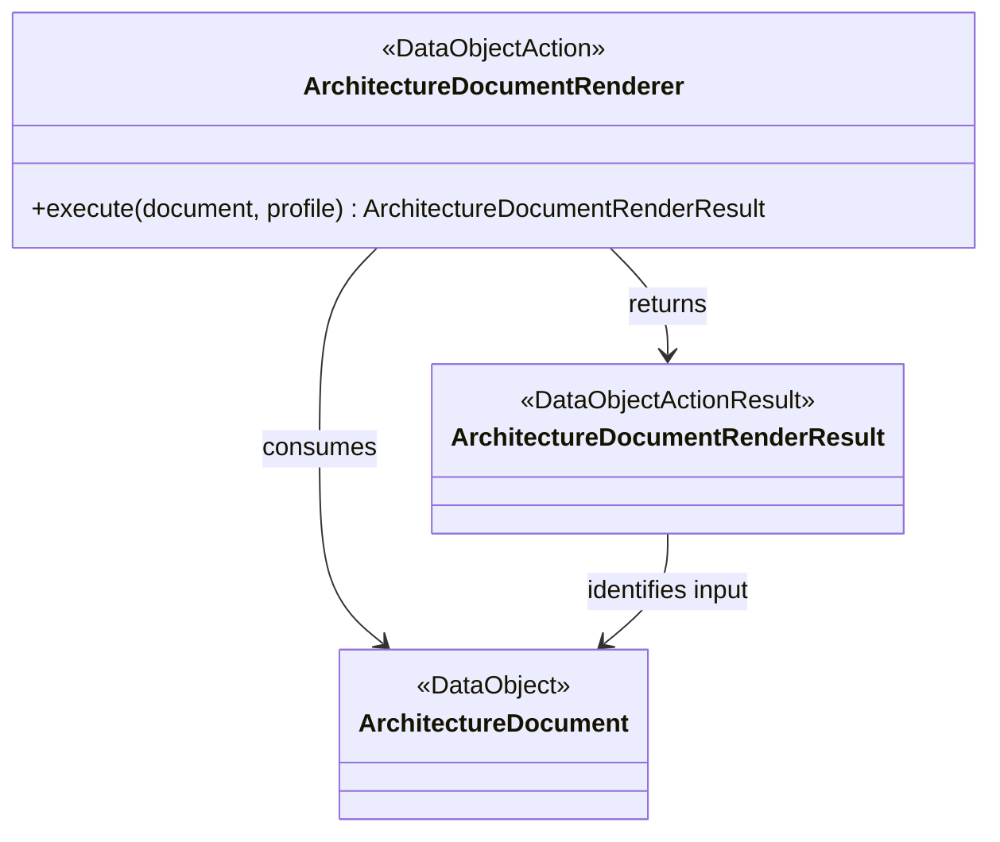

# Project Koios architecture v0

Status: **Draft**

Architecture v0 describes the intended Project Koios research platform before
its module contracts and implementation boundaries are accepted. It is a design
workspace, not implementation authority, scientific acceptance, or migration
authorization.

## Direction

Project Koios is intended to own the reusable research platform. A scientific
project such as `ksdft2effmass` should retain the scientific claims,
claim-specific interpretation, and domain-specific acceptance criteria that
make it scientifically distinct.

The extraction test is:

> Could another scientific project use this component without adopting the
> scientific claims of its source project?

If so, the component is a candidate for a Project Koios owner repository. This
does not mean that all implementation belongs in the `projectkoios` mothership.
The mothership owns cross-repository product architecture and durable domain
documents; component code remains with the applicable owner repository.

Working notes for the first source-project assessment are in the
[`ksdft2effmass` migration notes](notes/ksdft2eff-migration/index.md).

## Architecture as data

Module architecture will be authored as strict JSON and rendered
deterministically to Markdown:

```text
<module>.json
    ↓ validate closed schema and cross-record invariants
    ↓ render deterministic Markdown and Mermaid
<module>.md
```

The JSON record is authoritative for represented architecture data. The
Markdown file is its human-readable projection and is never edited
independently. Both files remain version controlled so architecture is readable
without running the renderer.

This index is a bootstrap navigation and planning document. The module records
listed below will adopt the JSON-to-Markdown projection after the projection
schema and renderer exist.

## Required module-document contents

Every `docs/architecture/v0/<module>.json` record and generated `.md` projection
must include:

1. module identity, version, status, and owner;
2. purpose, responsibilities, and explicit exclusions;
3. classes, attributes, and relationships;
4. a generated Mermaid class diagram;
5. object and cross-record invariants;
6. identities, serialization, and provenance;
7. lifecycle or data-flow descriptions;
8. failure and fail-closed behavior;
9. repository and import boundaries;
10. conformance fixtures and deferred decisions.

The renderer must reject duplicate JSON members, unknown fields, duplicate
identifiers, dangling relationships, invalid cardinalities, malformed diagram
content, and output drift.

## Python object model

The default operation shape combines the Project Koios DataObject-centered
model with the reusable ActionObject and result boundaries demonstrated in
`ksdft2effmass`:

```text
DataObject → DataObjectAction → DataObjectActionResult
```

These names describe architectural roles. They do not require public base
classes named `DataObject`, `DataObjectAction`, or
`DataObjectActionResult`. Concrete classes use domain names and the
architecture JSON records their role explicitly.



### DataObject

A DataObject is an immutable representation of domain state or an exact request.
It should normally be a frozen, slotted dataclass. It owns intrinsic field
invariants but does not perform filesystem access, network access, discovery,
serialization, rendering, persistence, scientific interpretation, or another
external effect.

Boundary Pydantic models are not internal DataObjects. An adapter converts a
validated boundary model into an internal DataObject.

### DataObjectAction

A DataObjectAction owns one named operation over explicit DataObject inputs. It
receives policy, dependencies, clocks, stores, and external clients explicitly;
it does not obtain them from mutable globals or ambient discovery. An action is
stateless unless its documented identity includes immutable configuration.

Concrete names should describe the behavior, such as
`ScientificMarkdownRenderer` or `MarkdownChunker`, rather than mechanically
appending `Action`. The architecture role remains `data_object_action`.

An Action class is warranted when the operation has meaningful policy,
dependencies, versioning, substitution, or a substantial invariant boundary. A
small owner-local pure transformation may remain a typed module-level function
rather than acquiring an otherwise empty class.

### DataObjectActionResult

A DataObjectActionResult is an immutable outcome of one exact action invocation.
It binds the relevant input, action, configuration, and output identities and
uses a closed outcome vocabulary when expected operational failure is part of
the contract. A result does not imply human acceptance, scientific validity,
publication, or workflow authority.

Expected domain outcomes belong in a result. Programming errors and violated
caller preconditions use specific built-in exceptions such as `TypeError` and
`ValueError`. Runtime validation must not depend on `assert`.

A DataObjectActionResult is distinct from a workflow `ResultObject`. A concrete
record may fill both roles only when its owning contract states that explicitly;
the architecture must not infer the relationship from a class-name suffix.

### Avoid nominal framework machinery

The v0 design does not introduce:

- a universal DataObject superclass;
- a universal Action registry or service locator;
- reflective action discovery;
- generic `to_json` or `from_json` methods on every DataObject;
- inheritance used only to attach an architectural label; or
- one result wrapper that erases domain-specific outcomes.

Serialization, persistence, rendering, and comparison remain named operations
owned by their applicable modules.

## Python code policy

The authoritative Draft policy source is
[`docs/policies/code/python.json`](../../policies/code/python.json). Its
human-readable projection is
[`docs/policies/code/python.md`](../../policies/code/python.md).

The policy owns the detailed DataObject, DataObjectAction,
DataObjectActionResult, Python, tooling, and judicious Google Python Style Guide
rules. This architecture index records their system-level use without creating
a second independently maintained coding policy.

## Initial module records

| Module | Responsibility | Planned owner |
|---|---|---|
| `architecture-document` | Closed JSON architecture model, DataObject/Action/Result roles, validation, Mermaid generation, and deterministic Markdown projection | `projectkoios` documentation tooling |
| `scientific-markdown` | Source-anchored scientific Markdown, equations, figures, assets, and provenance | `projectkoios-ingestion` |
| `citation-graph` | Citation occurrences, bibliography occurrences, canonical mappings, links, and derived backlinks | `projectkoios-references` |
| `markdown-chunking` | Markdown-AST-aware chunks, source-map retention, content roles, and purpose admission | `projectkoios-search` |
| `transcript-review-api` | Opaque, bounded API projection over Markdown and authoritative source evidence | `projectkoios-api` |
| `transcript-review-ui` | Markdown-first reading and evidence-inspection experience | `projectkoios-web` |

The owner column records the intended implementation boundary. Cross-repository
architecture remains documented here.

## Scientific Markdown pipeline

The intended evidence and retrieval chain is:

```text
authoritative PDF
    ↓
source-anchored evidence records and immutable assets
    ↓
immutable scientific Markdown
    ↓
Markdown-aware chunks
    ↓
purpose-scoped search projections
    ↓
API-backed reading and review UI
```

The PDF remains the source authority. The published `.md` file is the immediate
input to chunking and retrieval. Supporting machine-readable records map the
Markdown back to source pages, regions, blocks, equations, figures, citations,
and bibliography entries.

Changing the Markdown creates a new Markdown identity, new chunk identities,
and a new search projection. It does not mutate an earlier generation.

## Source-page identity

Page position and printed numbering are distinct:

- `page_index`: zero-based extractor position;
- `physical_pdf_page`: one-based PDF viewer page, equal to
  `page_index + 1`;
- `printed_page_label`: the exact page label printed by the source, including
  Arabic numbers, Roman numerals, appendix labels, or explicit absence.

Source links navigate by physical PDF page while displaying both physical and
printed identities. Printed labels are never inferred solely from an offset.

## Equation identity and numbering

Equations retain their exact printed source label and an independently resolved
canonical label. When numbering restarts at a chapter boundary, the canonical
label is chapter-qualified as `chapter.equation`.

Examples include `20.1`, `20.3a`, and `B.7`. An unnumbered or ambiguous equation
remains explicitly unresolved rather than receiving an invented label.

Equation content identity is independent of its readable number. References to
an equation are represented as edges to that equation occurrence, and reverse
backlinks are derived from those edges.

## Markdown chunking constraints

Chunking operates on the exact published Markdown bytes, not directly on the
PDF or an internal document graph. The chunker must be Markdown-AST-aware and
must preserve complete structural units.

It must not split:

- fenced or display-equation blocks;
- an equation from its number;
- a figure from its exact caption;
- citation syntax from its containing sentence;
- one bibliography entry; or
- machine-readable source-boundary markers.

Exact source-derived content and generated contextual descriptions must retain
separate content roles. Generated descriptions remain visibly marked
`AUTOMATED_UNREVIEWED` and cannot silently become citation evidence.

## Citation and backlink structure

Canonical relationships are stored once. For example, a citation occurrence
has one edge to a bibliography occurrence. Backlinks are reverse projections of
that edge rather than independently maintained authority.

Bibliography-to-canonical-reference mapping remains separately resolvable as
linked, ambiguous, or unresolved. Resolution fails closed and never invents an
entry or identifier.

## Architecture projection requirements

The architecture renderer will reuse and repackage applicable deterministic
projection techniques already developed in `ksdft2effmass`, including:

- strict JSON and duplicate-member rejection;
- Draft 2020-12 JSON Schema validation;
- immutable input and output identities;
- explicit projection profiles;
- exact UTF-8 Markdown bytes;
- byte-identical replay and drift checking;
- valid and invalid conformance fixtures; and
- resource-manifest identities.

The Project Koios implementation will remove source-project Task, chain,
activation, scientific-domain, SQLite, and harness-state semantics. Extraction
uses pinned committed source blobs, not an uncommitted working tree.

## Initial delivery sequence

1. Inventory the reusable committed `ksdft2effmass` projection assets.
2. Define the closed architecture-document JSON schema.
3. Repackage the strict loader, validator, renderer, and drift checker.
4. Add valid, invalid, exact-byte, and Mermaid conformance fixtures.
5. Represent `scientific-markdown` as the first architecture JSON record.
6. Generate its Markdown and verify byte-identical replay.
7. Represent citation, chunking, API, and Web modules only after the first
   projection proves the format.

## Boundaries

Architecture v0 does not by itself authorize:

- migration or deletion of `ksdft2effmass` code or documents;
- movement or acceptance of any scientific claim;
- private-document processing;
- scientific simulation or result interpretation;
- contract acceptance;
- production deployment or release; or
- replacement of existing immutable transcript generations.

Each extraction, implementation, publication, and acceptance step remains a
separate decision.
