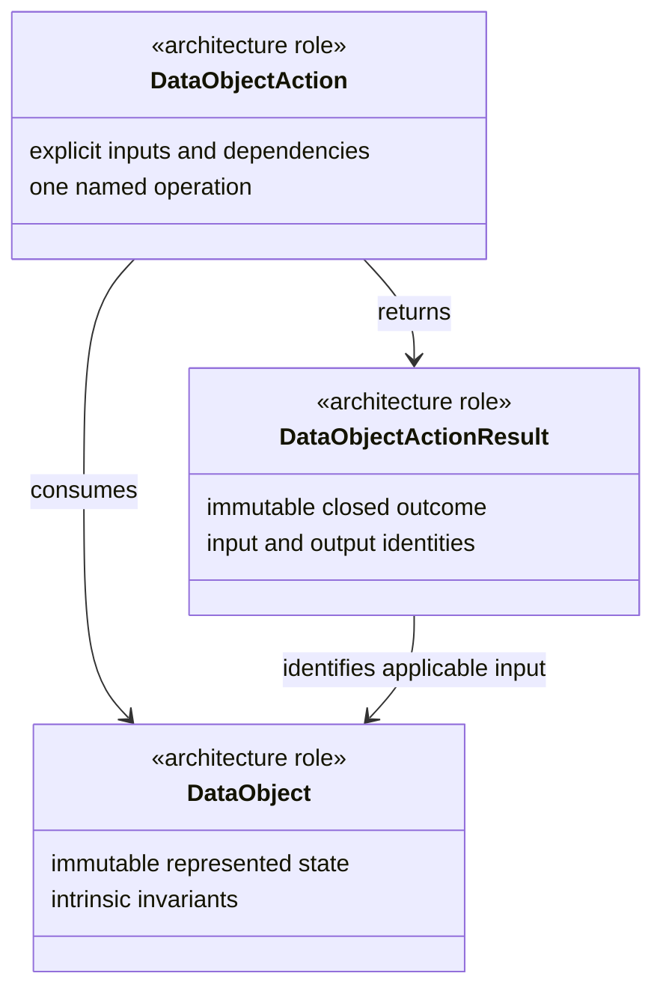

<!-- GENERATED FILE. DO NOT EDIT. -->

# Project Koios Python code policy

> **GENERATED MARKDOWN PROJECTION.**
> [`docs/policies/code/python.json`](python.json) is authoritative.
> Regenerate this file from that source; do not edit it independently.

- Policy ID: `projectkoios.code.python`
- Policy version: `0.1.0`
- Status: **Draft**
- Source SHA-256:
  `b29a5acbe5de5b40a6a146b705ef3822ba648d9d1005e4934337f0fb3024513b`

## Purpose

Define the default Python object model and selected implementation practices for Project Koios owner repositories.

## Scope

- New or materially changed Python production code owned by Project Koios repositories.
- Architecture records that classify Python classes by role.
- Repository-local documentation tooling implemented in Python.

## Exclusions

- Automatic repository-wide rewrites of conforming existing code.
- Scientific acceptance or correctness of domain algorithms.
- Replacement of owner-repository validation commands.
- A universal runtime framework or nominal base-class hierarchy.

## Precedence

From highest to lowest:

1. Accepted contracts and architecture decisions.
2. The owning repository's `AGENTS.md` and `pyproject.toml`.
3. This Project Koios Python policy.
4. Selected guidance from the Google Python Style Guide.

## Object model

The default operation flow is:

```text
DataObject → DataObjectAction → DataObjectActionResult
```

These are architecture roles. They do not require public classes named `DataObject`, `DataObjectAction`, or `DataObjectActionResult`.



### DataObject

Default Python form: frozen, slotted dataclass.

Responsibilities:

- Represent immutable domain state or one exact request.
- Validate intrinsic field invariants.
- Expose cheap, unsurprising derived properties when useful.

Prohibitions:

- Filesystem, network, process, clock, or database effects.
- Ambient discovery or mutable global state.
- Generic persistence, rendering, or serialization behavior.
- Cross-object policy or scientific acceptance decisions.

### DataObjectAction

Default Python form: behavior-named class with explicit dependencies.

Responsibilities:

- Perform one named operation over explicit `DataObject` inputs.
- Own cross-object policy and operation-specific validation.
- Receive stores, clocks, clients, configuration, and authority explicitly.
- Return one typed `DataObjectActionResult` when the operation has a represented outcome.

Prohibitions:

- Service-location globals or reflective action discovery.
- Hidden mutable state unrelated to immutable configuration.
- A generic registry that erases domain ownership.
- Use of `staticmethod` solely to hide a module-level helper.

### DataObjectActionResult

Default Python form: frozen, slotted dataclass with closed outcome.

Responsibilities:

- Represent the immutable outcome of one exact action invocation.
- Bind applicable input, action, configuration, output, and evidence identities.
- Represent expected domain failure using a closed outcome vocabulary.
- State limitations without implying human or scientific acceptance.

Prohibitions:

- Invented success values after an indeterminate or rejected operation.
- Conflation with a workflow `ResultObject` unless the owner contract states both roles.
- Unbounded exception text as the only machine-readable failure representation.
- Mutation of the input `DataObject`.

### Object-model rules

- The roles are architecture classifications and do not require public classes named `DataObject`, `DataObjectAction`, or `DataObjectActionResult`.
- Concrete class names use domain terms such as `ScientificMarkdownRenderer` and `ScientificMarkdownRenderResult`.
- An action class is used when policy, dependencies, versioning, substitution, or substantial invariants justify an object boundary.
- A small owner-local pure transformation may remain a typed module-level function.
- Programming errors and violated caller preconditions raise specific exceptions; expected operational outcomes use result records.
- Runtime validation must not depend on `assert`.
- Pydantic is used at external boundaries; internal records prefer frozen dataclasses.

## Google Python Style Guide profile

Project Koios applies explicit source-linked dispositions to a pinned Google Python Style Guide revision. The owning repository remains authoritative where an extracted rule is adapted.

### Upstream source

- Title: [Google Python Style Guide](https://github.com/google/styleguide/blob/3b8822983dc779c498961cc86332a28c07590f64/pyguide.md)
- Revision: `3b8822983dc779c498961cc86332a28c07590f64`
- Git blob SHA-1: `d8bd300157be2c1dd174450cc106ad27dc7e28e4`
- Source SHA-256: `4905b424258ffe7b4dabe133ca3c44de6e404370eadc7369b4532564ce0ff3cb`
- Source byte count: `117945`
- License: [CC-BY-3.0](https://github.com/google/styleguide/blob/3b8822983dc779c498961cc86332a28c07590f64/LICENSE)

This projection identifies modifications through explicit `ADAPT` dispositions and attributes the upstream guide to Google under CC BY 3.0.

### Extraction coverage

All major numbered Python language and style sections, plus Project Koios-relevant module, diagnostic, mathematical-notation, typing-import, and consistency rules.

Preserve a pinned upstream excerpt and record an explicit ADOPT or ADAPT disposition with one Project Koios rule and rationale.

### Rule dispositions

#### 2.1 Lint — ADAPT

- Rule ID: `google.pyguide.2.1`
- Upstream section: [2.1](https://github.com/google/styleguide/blob/3b8822983dc779c498961cc86332a28c07590f64/pyguide.md#s2.1-lint)

Upstream excerpt:

> Run `pylint` over your code using this [pylintrc](https://google.github.io/styleguide/pylintrc).

Project Koios rule:

Run the owning repository Ruff configuration and any additional owner checks instead of requiring Pylint.

Rationale:

Project Koios repositories standardize on Ruff; the upstream goal of automated linting is retained.

#### 2.2 Imports — ADAPT

- Rule ID: `google.pyguide.2.2`
- Upstream section: [2.2](https://github.com/google/styleguide/blob/3b8822983dc779c498961cc86332a28c07590f64/pyguide.md#s2.2-imports)

Upstream excerpt:

> Use `import` statements for packages and modules only, not for individual types, classes, or functions.

Project Koios rule:

Implementation modules import from the owning module. A subpackage __init__.py defines a small stable public API through explicit re-exports and __all__; it must not indiscriminately aggregate implementation objects.

Rationale:

Project Koios preserves implementation ownership while making each subpackage initializer an intentional API rather than an import dumping ground.

#### 2.3 Packages — ADOPT

- Rule ID: `google.pyguide.2.3`
- Upstream section: [2.3](https://github.com/google/styleguide/blob/3b8822983dc779c498961cc86332a28c07590f64/pyguide.md#s2.3-packages)

Upstream excerpt:

> Import each module using the full pathname location of the module.

Project Koios rule:

Use full absolute package paths for imports.

Rationale:

Absolute imports avoid ambiguous module resolution.

#### 2.4 Exceptions — ADOPT

- Rule ID: `google.pyguide.2.4`
- Upstream section: [2.4](https://github.com/google/styleguide/blob/3b8822983dc779c498961cc86332a28c07590f64/pyguide.md#s2.4-exceptions)

Upstream excerpt:

> Exceptions are allowed but must be used carefully.

Project Koios rule:

Exceptions are allowed but must be used carefully.

Rationale:

Adopted as written, subject to repository-local automation and the policy precedence order.

#### 2.5 Mutable Global State — ADOPT

- Rule ID: `google.pyguide.2.5`
- Upstream section: [2.5](https://github.com/google/styleguide/blob/3b8822983dc779c498961cc86332a28c07590f64/pyguide.md#s2.5-global-state)

Upstream excerpt:

> Avoid mutable global state.

Project Koios rule:

Avoid mutable global state.

Rationale:

Adopted as written, subject to repository-local automation and the policy precedence order.

#### 2.6 Nested/Local/Inner Classes and Functions — ADOPT

- Rule ID: `google.pyguide.2.6`
- Upstream section: [2.6](https://github.com/google/styleguide/blob/3b8822983dc779c498961cc86332a28c07590f64/pyguide.md#s2.6-nested)

Upstream excerpt:

> Nested local functions or classes are fine when used to close over a local variable. Inner classes are fine.

Project Koios rule:

Nested local functions or classes are fine when used to close over a local variable. Inner classes are fine.

Rationale:

Adopted as written, subject to repository-local automation and the policy precedence order.

#### 2.7 Comprehensions & Generator Expressions — ADOPT

- Rule ID: `google.pyguide.2.7`
- Upstream section: [2.7](https://github.com/google/styleguide/blob/3b8822983dc779c498961cc86332a28c07590f64/pyguide.md#s2.7-list_comprehensions)

Upstream excerpt:

> Okay to use for simple cases.

Project Koios rule:

Okay to use for simple cases.

Rationale:

Adopted as written, subject to repository-local automation and the policy precedence order.

#### 2.8 Default Iterators and Operators — ADOPT

- Rule ID: `google.pyguide.2.8`
- Upstream section: [2.8](https://github.com/google/styleguide/blob/3b8822983dc779c498961cc86332a28c07590f64/pyguide.md#s2.8-default-iterators-and-operators)

Upstream excerpt:

> Use default iterators and operators for types that support them, like lists, dictionaries, and files.

Project Koios rule:

Use default iterators and operators for types that support them, like lists, dictionaries, and files.

Rationale:

Adopted as written, subject to repository-local automation and the policy precedence order.

#### 2.9 Generators — ADOPT

- Rule ID: `google.pyguide.2.9`
- Upstream section: [2.9](https://github.com/google/styleguide/blob/3b8822983dc779c498961cc86332a28c07590f64/pyguide.md#s2.9-generators)

Upstream excerpt:

> Use generators as needed.

Project Koios rule:

Use generators as needed.

Rationale:

Adopted as written, subject to repository-local automation and the policy precedence order.

#### 2.10 Lambda Functions — ADOPT

- Rule ID: `google.pyguide.2.10`
- Upstream section: [2.10](https://github.com/google/styleguide/blob/3b8822983dc779c498961cc86332a28c07590f64/pyguide.md#s2.10-lambda-functions)

Upstream excerpt:

> Okay for one-liners. Prefer generator expressions over `map()` or `filter()` with a `lambda`.

Project Koios rule:

Okay for one-liners. Prefer generator expressions over map() or filter() with a lambda.

Rationale:

Adopted as written, subject to repository-local automation and the policy precedence order.

#### 2.11 Conditional Expressions — ADOPT

- Rule ID: `google.pyguide.2.11`
- Upstream section: [2.11](https://github.com/google/styleguide/blob/3b8822983dc779c498961cc86332a28c07590f64/pyguide.md#s2.11-conditional-expressions)

Upstream excerpt:

> Okay for simple cases.

Project Koios rule:

Okay for simple cases.

Rationale:

Adopted as written, subject to repository-local automation and the policy precedence order.

#### 2.12 Default Argument Values — ADOPT

- Rule ID: `google.pyguide.2.12`
- Upstream section: [2.12](https://github.com/google/styleguide/blob/3b8822983dc779c498961cc86332a28c07590f64/pyguide.md#s2.12-default-argument-values)

Upstream excerpt:

> Okay in most cases.

Project Koios rule:

Okay in most cases.

Rationale:

Adopted as written, subject to repository-local automation and the policy precedence order.

#### 2.13 Properties — ADOPT

- Rule ID: `google.pyguide.2.13`
- Upstream section: [2.13](https://github.com/google/styleguide/blob/3b8822983dc779c498961cc86332a28c07590f64/pyguide.md#s2.13-properties)

Upstream excerpt:

> Properties may be used to control getting or setting attributes that require trivial computations or logic. Property implementations must match the general expectations of regular attribute access: that they are cheap, straightforward, and unsurprising.

Project Koios rule:

Properties may be used to control getting or setting attributes that require trivial computations or logic. Property implementations must match the general expectations of regular attribute access: that they are cheap, straightforward, and unsurprising.

Rationale:

Adopted as written, subject to repository-local automation and the policy precedence order.

#### 2.14 True/False Evaluations — ADOPT

- Rule ID: `google.pyguide.2.14`
- Upstream section: [2.14](https://github.com/google/styleguide/blob/3b8822983dc779c498961cc86332a28c07590f64/pyguide.md#s2.14-truefalse-evaluations)

Upstream excerpt:

> Use the "implicit" false if at all possible (with a few caveats).

Project Koios rule:

Use the "implicit" false if at all possible (with a few caveats).

Rationale:

Adopted as written, subject to repository-local automation and the policy precedence order.

#### 2.16 Lexical Scoping — ADOPT

- Rule ID: `google.pyguide.2.16`
- Upstream section: [2.16](https://github.com/google/styleguide/blob/3b8822983dc779c498961cc86332a28c07590f64/pyguide.md#s2.16-lexical-scoping)

Upstream excerpt:

> Okay to use.

Project Koios rule:

Okay to use.

Rationale:

Adopted as written, subject to repository-local automation and the policy precedence order.

#### 2.17 Function and Method Decorators — ADOPT

- Rule ID: `google.pyguide.2.17`
- Upstream section: [2.17](https://github.com/google/styleguide/blob/3b8822983dc779c498961cc86332a28c07590f64/pyguide.md#s2.17-function-and-method-decorators)

Upstream excerpt:

> Use decorators judiciously when there is a clear advantage. Avoid `staticmethod` and limit use of `classmethod`.

Project Koios rule:

Use decorators judiciously when there is a clear advantage. Avoid `staticmethod` and limit use of classmethod.

Rationale:

Adopted as written, subject to repository-local automation and the policy precedence order.

#### 2.18 Threading — ADOPT

- Rule ID: `google.pyguide.2.18`
- Upstream section: [2.18](https://github.com/google/styleguide/blob/3b8822983dc779c498961cc86332a28c07590f64/pyguide.md#s2.18-threading)

Upstream excerpt:

> Do not rely on the atomicity of built-in types.

Project Koios rule:

Do not rely on the atomicity of built-in types.

Rationale:

Adopted as written, subject to repository-local automation and the policy precedence order.

#### 2.19 Power Features — ADOPT

- Rule ID: `google.pyguide.2.19`
- Upstream section: [2.19](https://github.com/google/styleguide/blob/3b8822983dc779c498961cc86332a28c07590f64/pyguide.md#s2.19-power-features)

Upstream excerpt:

> Avoid these features.

Project Koios rule:

Avoid these features.

Rationale:

Adopted as written, subject to repository-local automation and the policy precedence order.

#### 2.20 Modern Python: from __future__ imports — ADAPT

- Rule ID: `google.pyguide.2.20`
- Upstream section: [2.20](https://github.com/google/styleguide/blob/3b8822983dc779c498961cc86332a28c07590f64/pyguide.md#s2.20-modern-python)

Upstream excerpt:

> New language version semantic changes may be gated behind a special future import to enable them on a per-file basis within earlier runtimes.

Project Koios rule:

Every Project Koios Python module retains `from __future__ import annotations` under the current Python 3.14 repository rule.

Rationale:

The repository intentionally keeps this declaration as an explicit compatibility and annotation policy.

#### 2.21 Type Annotated Code — ADAPT

- Rule ID: `google.pyguide.2.21`
- Upstream section: [2.21](https://github.com/google/styleguide/blob/3b8822983dc779c498961cc86332a28c07590f64/pyguide.md#s2.21-typed-code)

Upstream excerpt:

> You can annotate Python code with [type hints](https://docs.python.org/3/library/typing.html). Type-check the code at build time with a type checking tool like [pytype](https://github.com/google/pytype). In most cases, when feasible, type annotations are in source files. For third-party or extension modules, annotations can be in [stub `.pyi` files](https://peps.python.org/pep-0484/#stub-files).

Project Koios rule:

Annotate public APIs and run MyPy using the owning repository configuration.

Rationale:

MyPy replaces the upstream pytype recommendation while preserving static type analysis.

#### 3.1 Semicolons — ADOPT

- Rule ID: `google.pyguide.3.1`
- Upstream section: [3.1](https://github.com/google/styleguide/blob/3b8822983dc779c498961cc86332a28c07590f64/pyguide.md#s3.1-semicolons)

Upstream excerpt:

> Do not terminate your lines with semicolons, and do not use semicolons to put two statements on the same line.

Project Koios rule:

Do not terminate your lines with semicolons, and do not use semicolons to put two statements on the same line.

Rationale:

Adopted as written, subject to repository-local automation and the policy precedence order.

#### 3.2 Line length — ADAPT

- Rule ID: `google.pyguide.3.2`
- Upstream section: [3.2](https://github.com/google/styleguide/blob/3b8822983dc779c498961cc86332a28c07590f64/pyguide.md#s3.2-line-length)

Upstream excerpt:

> Maximum line length is *80 characters*.

Project Koios rule:

Use the owning Ruff line-length configuration, currently 80 characters, with only tool-supported or clearly documented exceptions.

Rationale:

The upstream limit is retained and enforced by the repository toolchain.

#### 3.3 Parentheses — ADOPT

- Rule ID: `google.pyguide.3.3`
- Upstream section: [3.3](https://github.com/google/styleguide/blob/3b8822983dc779c498961cc86332a28c07590f64/pyguide.md#s3.3-parentheses)

Upstream excerpt:

> Use parentheses sparingly.

Project Koios rule:

Use parentheses sparingly.

Rationale:

Adopted as written, subject to repository-local automation and the policy precedence order.

#### 3.4 Indentation — ADOPT

- Rule ID: `google.pyguide.3.4`
- Upstream section: [3.4](https://github.com/google/styleguide/blob/3b8822983dc779c498961cc86332a28c07590f64/pyguide.md#s3.4-indentation)

Upstream excerpt:

> Indent your code blocks with *4 spaces*.

Project Koios rule:

Use four-space indentation, never tabs, and the owning Ruff formatter for continuation layout.

Rationale:

The formatter provides the deterministic local realization of the upstream rule.

#### 3.5 Blank Lines — ADOPT

- Rule ID: `google.pyguide.3.5`
- Upstream section: [3.5](https://github.com/google/styleguide/blob/3b8822983dc779c498961cc86332a28c07590f64/pyguide.md#s3.5-blank-lines)

Upstream excerpt:

> Two blank lines between top-level definitions, be they function or class definitions. One blank line between method definitions and between the docstring of a `class` and the first method. No blank line following a `def` line. Use single blank lines as you judge appropriate within functions or methods.

Project Koios rule:

Use the owning Ruff formatter for deterministic blank-line layout.

Rationale:

The upstream spacing rule is retained through automated formatting.

#### 3.6 Whitespace — ADOPT

- Rule ID: `google.pyguide.3.6`
- Upstream section: [3.6](https://github.com/google/styleguide/blob/3b8822983dc779c498961cc86332a28c07590f64/pyguide.md#s3.6-whitespace)

Upstream excerpt:

> Follow standard typographic rules for the use of spaces around punctuation.

Project Koios rule:

Use standard Python whitespace as enforced by Ruff and its formatter.

Rationale:

Automated enforcement avoids independent formatting interpretations.

#### 3.7 Shebang Line — ADOPT

- Rule ID: `google.pyguide.3.7`
- Upstream section: [3.7](https://github.com/google/styleguide/blob/3b8822983dc779c498961cc86332a28c07590f64/pyguide.md#s3.7-shebang-line)

Upstream excerpt:

> Most `.py` files do not need to start with a `#!` line. Start the main file of a program with `#!/usr/bin/env python3` (to support virtualenvs) or `#!/usr/bin/python3` per [PEP-394](https://peps.python.org/pep-0394/).

Project Koios rule:

Most .py files do not need to start with a #! line. Start the main file of a program with #!/usr/bin/env python3 (to support virtualenvs) or #!/usr/bin/python3 per PEP-394.

Rationale:

Adopted as written, subject to repository-local automation and the policy precedence order.

#### 3.8 Comments and Docstrings — ADOPT

- Rule ID: `google.pyguide.3.8`
- Upstream section: [3.8](https://github.com/google/styleguide/blob/3b8822983dc779c498961cc86332a28c07590f64/pyguide.md#s3.8-comments)

Upstream excerpt:

> Be sure to use the right style for module, function, method docstrings and inline comments.

Project Koios rule:

Use useful module, public API, class, function, method, and non-obvious implementation documentation without redundant prose.

Rationale:

The upstream documentation purpose and structure are retained.

#### 3.8.2 Modules — ADAPT

- Rule ID: `google.pyguide.3.8.2`
- Upstream section: [3.8.2](https://github.com/google/styleguide/blob/3b8822983dc779c498961cc86332a28c07590f64/pyguide.md#s3.8.2-comments-in-modules)

Upstream excerpt:

> Every file should contain license boilerplate.

Project Koios rule:

Every module has a useful module docstring; file-level license boilerplate is added only when the owning repository requires it.

Rationale:

The repository-level Apache-2.0 license remains authoritative without mandatory per-file repetition.

#### 3.10 Strings — ADAPT

- Rule ID: `google.pyguide.3.10`
- Upstream section: [3.10](https://github.com/google/styleguide/blob/3b8822983dc779c498961cc86332a28c07590f64/pyguide.md#s3.10-strings)

Upstream excerpt:

> Use an [f-string](https://docs.python.org/3/reference/lexical_analysis.html#f-strings), the `%` operator, or the `format` method for formatting strings, even when the parameters are all strings. Use your best judgment to decide between string formatting options. A single join with `+` is okay but do not format with `+`.

Project Koios rule:

Use double quotes under the repository Ruff configuration and use explicit formatting methods rather than repeated string concatenation.

Rationale:

The upstream permits either quote style; Project Koios chooses deterministic double quotes.

#### 3.10.2 Error Messages — ADOPT

- Rule ID: `google.pyguide.3.10.2`
- Upstream section: [3.10.2](https://github.com/google/styleguide/blob/3b8822983dc779c498961cc86332a28c07590f64/pyguide.md#s3.10.2-error-messages)

Upstream excerpt:

> Error messages (such as: message strings on exceptions like `ValueError`, or messages shown to the user) should follow three guidelines:

Project Koios rule:

Error messages precisely match the condition, identify interpolated values, and support automated processing; stable machine-readable codes accompany expected operational findings.

Rationale:

Machine-readable result codes strengthen the upstream diagnostic rule.

#### 3.11 Files, Sockets, and similar Stateful Resources — ADOPT

- Rule ID: `google.pyguide.3.11`
- Upstream section: [3.11](https://github.com/google/styleguide/blob/3b8822983dc779c498961cc86332a28c07590f64/pyguide.md#s3.11-files-and-sockets)

Upstream excerpt:

> Explicitly close files and sockets when done with them. This rule naturally extends to closeable resources that internally use sockets, such as database connections, and also other resources that need to be closed down in a similar fashion. To name only a few examples, this also includes [mmap](https://docs.python.org/3/library/mmap.html) mappings, [h5py File objects](https://docs.h5py.org/en/stable/high/file.html), and [matplotlib.pyplot figure windows](https://matplotlib.org/2.1.0/api/_as_gen/matplotlib.pyplot.close.html).

Project Koios rule:

Explicitly close files and sockets when done with them. This rule naturally extends to closeable resources that internally use sockets, such as database connections, and also other resources that need to be closed down in a similar fashion. To name only a few examples, this also includes mmap mappings, h5py File objects, and matplotlib.pyplot figure windows.

Rationale:

Adopted as written, subject to repository-local automation and the policy precedence order.

#### 3.12 TODO Comments — ADAPT

- Rule ID: `google.pyguide.3.12`
- Upstream section: [3.12](https://github.com/google/styleguide/blob/3b8822983dc779c498961cc86332a28c07590f64/pyguide.md#s3.12-todo-comments)

Upstream excerpt:

> Use `TODO` comments for code that is temporary, a short-term solution, or good-enough but not perfect.

Project Koios rule:

TODO comments identify a durable issue or decision record and explain the remaining work.

Rationale:

Project Koios uses owner-repository issue and decision systems rather than Google-internal references.

#### 3.13 Imports formatting — ADOPT

- Rule ID: `google.pyguide.3.13`
- Upstream section: [3.13](https://github.com/google/styleguide/blob/3b8822983dc779c498961cc86332a28c07590f64/pyguide.md#s3.13-imports-formatting)

Upstream excerpt:

> Imports should be on separate lines; there are [exceptions for `typing` and `collections.abc` imports](#typing-imports).

Project Koios rule:

Group and sort imports using the owning Ruff configuration.

Rationale:

Ruff implements the upstream ordering requirement deterministically.

#### 3.14 Statements — ADOPT

- Rule ID: `google.pyguide.3.14`
- Upstream section: [3.14](https://github.com/google/styleguide/blob/3b8822983dc779c498961cc86332a28c07590f64/pyguide.md#s3.14-statements)

Upstream excerpt:

> Generally only one statement per line.

Project Koios rule:

Generally only one statement per line.

Rationale:

Adopted as written, subject to repository-local automation and the policy precedence order.

#### 3.15 Getters and Setters — ADOPT

- Rule ID: `google.pyguide.3.15`
- Upstream section: [3.15](https://github.com/google/styleguide/blob/3b8822983dc779c498961cc86332a28c07590f64/pyguide.md#s3.15-access-control)

Upstream excerpt:

> Getter and setter functions (also called accessors and mutators) should be used when they provide a meaningful role or behavior for getting or setting a variable's value.

Project Koios rule:

Getter and setter functions (also called accessors and mutators) should be used when they provide a meaningful role or behavior for getting or setting a variable's value.

Rationale:

Adopted as written, subject to repository-local automation and the policy precedence order.

#### 3.16 Naming — ADAPT

- Rule ID: `google.pyguide.3.16`
- Upstream section: [3.16](https://github.com/google/styleguide/blob/3b8822983dc779c498961cc86332a28c07590f64/pyguide.md#s3.16-naming)

Upstream excerpt:

> `module_name`, `package_name`, `ClassName`, `method_name`, `ExceptionName`, `function_name`, `GLOBAL_CONSTANT_NAME`, `global_var_name`, `instance_var_name`, `function_parameter_name`, `local_var_name`, `query_proper_noun_for_thing`, `send_acronym_via_https`.

Project Koios rule:

Use descriptive Google-style Python names, while repository test functions retain the established test__subject__description convention.

Rationale:

The repository test convention is deliberate and locally authoritative.

#### 3.16.5 Mathematical Notation — ADOPT

- Rule ID: `google.pyguide.3.16.5`
- Upstream section: [3.16.5](https://github.com/google/styleguide/blob/3b8822983dc779c498961cc86332a28c07590f64/pyguide.md#math-notation)

Upstream excerpt:

> For mathematically-heavy code, short variable names that would otherwise violate the style guide are preferred when they match established notation in a reference paper or algorithm.

Project Koios rule:

Established mathematical notation is allowed in narrow scopes when its source and meaning are documented; public APIs prefer descriptive names.

Rationale:

This is directly applicable to scientific software while retaining source provenance.

#### 3.17 Main — ADOPT

- Rule ID: `google.pyguide.3.17`
- Upstream section: [3.17](https://github.com/google/styleguide/blob/3b8822983dc779c498961cc86332a28c07590f64/pyguide.md#s3.17-main)

Upstream excerpt:

> In Python, `pydoc` as well as unit tests require modules to be importable. If a file is meant to be used as an executable, its main functionality should be in a `main()` function, and your code should always check `if __name__ == '__main__'` before executing your main program, so that it is not executed when the module is imported.

Project Koios rule:

In Python, pydoc as well as unit tests require modules to be importable. If a file is meant to be used as an executable, its main functionality should be in a main() function, and your code should always check if __name__ == '__main__' before executing your main program, so that it is not executed when the module is imported.

Rationale:

Adopted as written, subject to repository-local automation and the policy precedence order.

#### 3.18 Function length — ADOPT

- Rule ID: `google.pyguide.3.18`
- Upstream section: [3.18](https://github.com/google/styleguide/blob/3b8822983dc779c498961cc86332a28c07590f64/pyguide.md#s3.18-function-length)

Upstream excerpt:

> Prefer small and focused functions.

Project Koios rule:

Prefer small and focused functions.

Rationale:

Adopted as written, subject to repository-local automation and the policy precedence order.

#### 3.19.12 Imports For Typing — ADOPT

- Rule ID: `google.pyguide.3.19.12`
- Upstream section: [3.19.12](https://github.com/google/styleguide/blob/3b8822983dc779c498961cc86332a28c07590f64/pyguide.md#s3.19.12-imports-for-typing)

Upstream excerpt:

> For symbols (including types, functions, and constants) from the `typing` or `collections.abc` modules used to support static analysis and type checking, always import the symbol itself.

Project Koios rule:

Direct symbol imports are allowed from typing and collections.abc for static analysis; other imports remain module-qualified.

Rationale:

This is the explicit exemption to the module-import rule.

#### 4 Parting Words — ADOPT

- Rule ID: `google.pyguide.4`
- Upstream section: [4](https://github.com/google/styleguide/blob/3b8822983dc779c498961cc86332a28c07590f64/pyguide.md#consistency)

Upstream excerpt:

> *BE CONSISTENT*.

Project Koios rule:

Prefer local consistency for choices not fixed by higher-precedence contracts, policy, `AGENTS.md`, or `pyproject.toml`.

Rationale:

Local consistency cannot silently override accepted Project Koios authority.

## Python rules

- Every module starts with `from __future__ import annotations` after any required module docstring placement rules.
- Internal immutable records use `dataclass(frozen=True, slots=True)` unless a documented requirement needs another form.
- Every named variable has an explicit type annotation where Python syntax permits one.
- Public and private methods have explicit parameter and return annotations, and every parameter after self or cls is keyword-only unless a language or framework protocol requires another signature.
- Method calls spell every argument name where the called signature permits keyword arguments.
- Small private helper behavior belongs to the class that owns the behavior rather than a private module-level function.
- Implementation modules import from the owning module; subpackage __init__.py files expose a small intentional public API through explicit re-exports and __all__ rather than aggregating implementation objects indiscriminately.
- `None` checks use `is None` or `is not None`.
- Mutable values are defensively copied or normalized before storage in immutable records.
- Unknown serialized fields, duplicate JSON members, unsupported versions, and malformed values fail closed.
- Externally supplied JSON is byte-bounded before parsing and depth, collection, and string-bounded before `DataObject` construction.
- Serialization, rendering, persistence, comparison, and external effects belong to named actions or adapters.
- Properties remain cheap, deterministic, and free of externally visible effects.
- Public action dependencies are supplied through construction or method parameters, not ambient discovery.
- Expected effect ambiguity produces an indeterminate result and reconciliation evidence rather than an automatic retry.

## Minimum validation

```bash
ruff check .
mypy src/python
pytest
```

The owning repository may define stricter or differently scoped commands.

Passing software checks does not establish architecture acceptance, scientific validity, publication authority, or release readiness.

Generated Markdown is checked byte-for-byte against the deterministic projection of this JSON source.

## Deferred decisions

- Acceptance of the Draft schema for code-policy JSON records.
- Cross-repository automated policy conformance beyond existing owner commands.
- Whether repeated use justifies extracting documentation tooling into a separate package.
